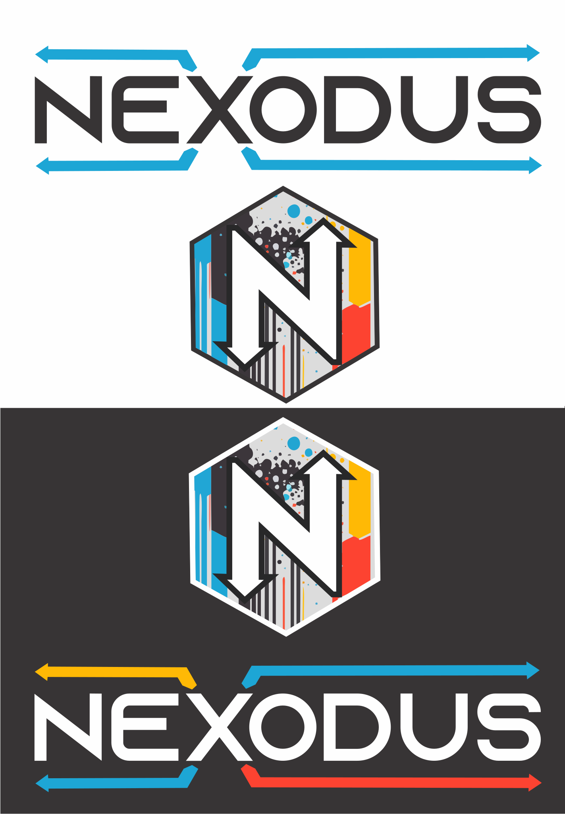
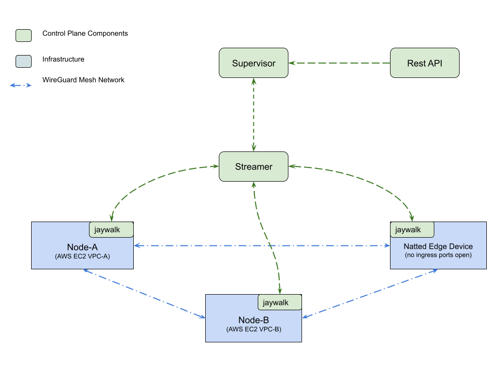
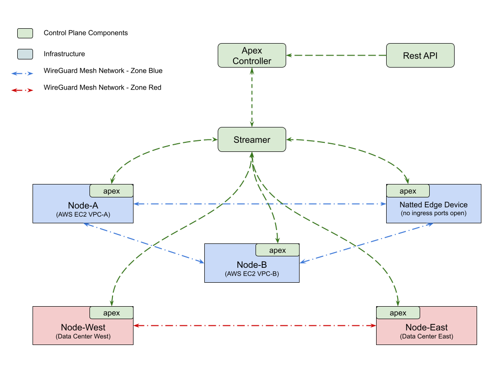
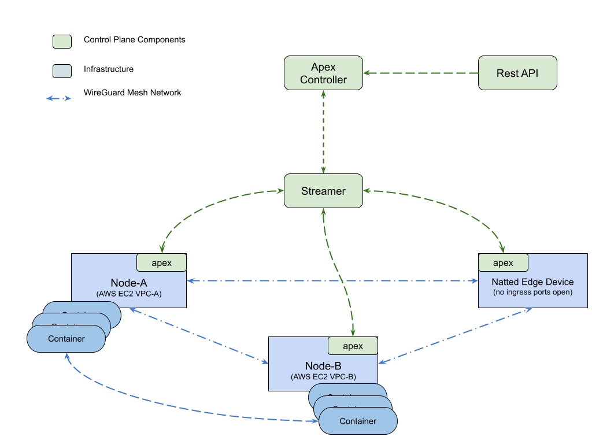

# 

[](https://github.com/redhat-et/apex/actions/workflows/build.yml)

*Roads? Where we're going, we don't need roads - Dr Emmett Brown*

Goal of this project is to provide connectivity service between nodes deployed across heterogeneous environment (Edge, Public, Private & Hybrid Cloud), with different level of visibilities like nodes in Cloud VPC, nodes behind NAT etc. This solution is not specific to any platform, but just focuses on providing connectivity between nodes and the container/VM workload running on it. This services provides a solution that is complimentary to the platform specific network solution. Platform network solution can leverage this service to simplify their stack.

Some of the high level features that this project is planning to provide are:
- IOT networking to any node anywhere regardless of the platform
- Hybrid data center connectivity that circumvents NAT challenges
- Take a connectivity portion out of platform concerns, reset back to the original K8s days, /32 routed network
- IP mobility
- Zero-trust - how do you do zero-trust without a zero trust networking story outside of shift?
- Backend Container connectivity to external nodes that are not part of K8s/docker/podman and have no idea about k8s/docker/podman (across clouds, through NAT and encrypted)
- Compliance scenario where a bunch of nodes need to be isolated from one another (PCI)
- Generic platform agnostic approach for workloads not tied to a platform.

## Aircrew and connectivity scenarios:

### 1. Mesh Network between nodes deployed across different VPC and at Edge



*Figure 1. Getting started topology that can be setup in minutes.* 

Please follow the instructions below to setup the connectivity scenario shown above.

#### **Setup the node that is getting onboarded to the mesh:**

You can directly build the required binaries from the source code

```shell
git clone https://github.com/redhat-et/jaywalking
go install ./...
```
to build for Linux OS node
```shell
GOOS=linux GOARCH=amd64 go build -o aircrew-amd64-linux ./cmd/aircrew
```

to build for Mac OS node 
```shell
GOOS=darwin GOARCH=amd64 go build -o aircrew-amd64-darwin ./cmd/aircrew
```

Or download a recent binaries to the nodes:

*OSX Binary*

```shell
sudo curl https://jaywalking.s3.amazonaws.com/aircrew-amd64-darwin --output /usr/local/sbin/aircrew
sudo chmod +x /usr/local/sbin/aircrew
```

*Linux Binary*
```shell
sudo curl https://jaywalking.s3.amazonaws.com/aircrew-amd64-linux --output /usr/local/sbin/aircrew
sudo chmod +x /usr/local/sbin/aircrew
```

#### **Start the ControlTower stack**
- ControlTower stack can run anywhere, as far as the aircrew agents (mentioned below) can reach it.
- The ControlTower must be running for agents to connect to the tunnel mesh. 
- If the ControlTower becomes unavailable, agent nodes continue functioning, only new nodes cannot join the mesh while it is down. 
- The same applies to the aircrew agent, if the agent process exits, tunnels are maintained and only new peer joins are affected.

You can start the ControlTower stack using docker-compose or even podman-compose
```shell
docker-compose build
docker-compose up -d
```
You may opt not to use `docker-compose build` if you'd rather use prebuilt images from CI.
Ports are exposed to your host machine for ease of use.

#### **Generate private/public key pair for nodes**
Key pair is needed for the node to connect in the mesh network. For a Linux node run the following commands.ex. ~/.wireguard/

```shell
wg genkey | sudo tee /etc/wireguard/server_private.key | wg pubkey | sudo tee /etc/wireguard/server_public.key
```
For Windows and Mac adjust the paths to existing directories. 

**NOTE**: Make sure the node has wireguard installed. You can use following command to install wireguard on Ubuntu
 ```shell
 apt install wireguard-tools
 ```

#### **Start the Aircrew agent**
 Start the aircrew agent on the node you want to join the mesh network and fill in the relevant configuration. IP addressing of the mesh network is managed via the ControlTower. Run the following commands on all the nodes:
 **Note**: If your test nodes does nodes are on internal networks and not on something like EC2 use the `--network-internal` flag  which will use an IP from your host instead of discovering your public NAT address or provide a specific address with `--local-endpoint-ip=x.x.x.x`:

There are currently 3 scenarios that allow an operator to define how the peers in a mesh are defined. There is a public address or cloud scenario, a private network address option and the ability to define exactly what address a peer will use when being mapped to a public key in the mesh. The following is an example of each:

1. If the node has access from the Internet allowed in on UDP port 51820 (AWS EC2 for example).
This is currently the default behavior as public CSP to private edge is primary a focus of the project.

```shell
sudo aircrew --public-key=<NODE_WIREGUARD_PUBLIC_KEY> \
--private-key=<NODE_WIREGUARD_PRIVATE_KEY> \
    --controller=<REDIS_SERVER_ADDRESS> \
    --controller-password=<REDIS_PASSWORD> 
```

2. If the node does not have inbound access on UDP port 51820 and a publicly reachable address,
the following will use an existing IP on the node as the peer endpoint address. This would 
create internal peering to other nodes in your network or allow the node to initiate peers
to public machines in the cloud. (--local-endpoint-ip)
```shell
sudo aircrew --public-key=<NODE_WIREGUARD_PUBLIC_KEY> \
--private-key=<NODE_WIREGUARD_PRIVATE_KEY> \
    --controller=<REDIS_SERVER_ADDRESS> \
    --controller-password=<REDIS_PASSWORD> \
    --local-endpoint-ip=X.X.X.X
```
3.  If an operator wants complete control over what address will be advertised to it's
peers, they can specify the endpoint address that will be distributed to all of the other 
peers in the mesh. (--internal-network)
```shell
sudo aircrew --public-key=<NODE_WIREGUARD_PUBLIC_KEY> \
--private-key=<NODE_WIREGUARD_PRIVATE_KEY> \
    --controller=<REDIS_SERVER_ADDRESS> \
    --controller-password=<REDIS_PASSWORD>\
    --internal-network
```
**NOTES**
- *By default, the node joins a zone named `default`. A **zone** is simply the isolated wireguard network where all the nodes in that zone is connected as a mesh (as depicted in **Figure 1**).*
- *The default zone prefix is currently hardcoded to `10.200.1.0/20`. Custom zones and IPAM are in the next example.*
- *While we pass the private key via CLI in the examples (dev/demo purposes only), we would highly recommend using the cli flag `--private-key-file=/path/to/private.key` or ENV `AIRCREW_PRIVATE_KEY_FILE=/path/to/private.key` in all scenarios where key safety protection is an issue.*

You will now have a flat host routed network between the endpoints. All of the wg0 (wireguard) interfaces can now reach one another. We currently work around NAT with a hacky STUN-like server to automatically discover public addressing for the user.


### 2. Multiple mesh network between nodes deployed across different VPC and at Edge (Multi-Tenancy)

This scenario shows how user can create multiple zone and connect the devices to these zone, to support multi tenant use cases. It also supports overlapping CIDR IPv4 or IPv6 across different zones.



*Figure 2. Create multiple zones and connect nodes to each of these zone with network isolation.*

Follow the below instructions to setup this connectivity scenario. In this scenario, two zones are setup that are completely isolated from one another and can have overlapping CIDRs. If you were to add more nodes to either zone, the new nodes could communicate to other nodes in it's zone but not to a different zone. Zones are completely separate overlays and tenants.

**Note:** in the following example, the CIDR ranges can overlap since each zone is a separate peering mesh isolated from one another.

#### **Create the zones via the REST API on the ControlTower**
In the following curl command, replace localhost with the IP address of the node the ControlTower is running on:

Create zone blue:
```shell
curl -L -X POST 'http://localhost:8080/zone' \
-H 'Content-Type: application/json' \
--data-raw '{
    "Name": "zone-blue",
    "Description": "Tenant - Zone Blue",
    "CIDR": "10.140.0.0/20"
}'
```

Create zone red:
```shell
curl -L -X POST 'http://localhost:8080/zone' \
-H 'Content-Type: application/json' \
--data-raw '{
    "Name": "zone-red",
    "Description": "Tenant - Zone Red",
    "CIDR": "172.20.0.0/20"
}'
```

#### **Verify the created zones**

```shell
curl -L -X GET 'http://localhost:8080/zones'
```

#### **Join the nodes to the zones**
A node can only belong to one zone at a time for isolation between tenants/security zones.

**Disclaimer:** if the zone does not exist, we do not currently handle an error channel back from the ControlTower, so the agent will just sit there. Tail the ControlTower logs for specifics and debugging.

To join zone blue:
```shell
sudo aircrew --public-key=<NODE_WIREGUARD_PUBLIC_KEY_A>  \
    --private-key=<NODE_WIREGUARD_PRIVATE_KEY_A>  \
    --controller=<REDIS_SERVER_ADDRESS> \
    --controller-password=<REDIS_PASSWORD> \
    --zone=zone-blue 
```
To join zone red:
```shell
sudo aircrew --public-key=<NODE_WIREGUARD_PUBLIC_KEY_B>  \
    --private-key=<NODE_WIREGUARD_PRIVATE_KEY_B>  \
    --controller=<REDIS_SERVER_ADDRESS> \
    --controller-password=<REDIS_PASSWORD> \
    --zone=zone-red 
```

Once you have more than one node in a zone, the nodes can now ping one another on using the wireguard interfaces. Get the address by running following command on the node:

```shell
# Linux
ip a wg0
# OSX - Note: OSX maps wg0 to tun(n). Generally 'ifconfig utun3' will show you the specific interface
ifconfig
```

You can also view the lease state of the IPAM objects with:

```shell
curl http://localhost:8080/ipam/leases/zone-blue
```
Curl should respond with output similar to the following

```
[
    {
        "Cidr": "10.140.0.0/20",
        "IPs": {
            "10.140.0.0": true,
            "10.140.0.1": true,
            "10.140.0.2": true,
            "10.140.15.255": true
        }
    }
]
```

**NOTES**
- If user would like to request a particular IP address from the IPAM module it can request the IP with the config option `--request-ip`. If an existing lease exists, it will be released and offered to the node requesting it. The IP you are requesting has to be in the CIDR range of the zone's prefix.


### 3. Mesh network between containers running on connected nodes

Imagine a user wants to not only communicate between the node address each member of the mesh but also want to advertise
some additional IP prefixes for additional services running on a node. This can be accomplished with the `--child-prefix` flag.
Prefixes have to be unique within a zone but can overlap on separate zones.

The following example allows a user to connect Docker container directly to one another without exposing a port on the node.
These nodes could be in different data centers or CSPs. This example uses the `--child-prefix` option to advertise the private
container networks to the mesh and enable connectivity as depicted below.



*Figure 3. Encrypt and connect private RFC-1918 addresses and services in containers to all nodes in the mesh regardless of location*


For simplicity, we are just using the default, built-in zone `default`. You can also use the zones you created in the previous exercise or create a new one.

**Node1 setup:**

Join node1 to the `default` zone network
```shell
sudo aircrew --public-key=<NODE_WIREGUARD_PUBLIC_KEY_A>  \
    --private-key=<NODE_WIREGUARD_PRIVATE_KEY_A>  \
    --controller=<REDIS_SERVER_ADDRESS> \
    --controller-password=<REDIS_PASSWORD> \
    --child-prefix=172.24.0.0/24 \
    --zone=default 
```

Create the container network:
```shell
docker network create --driver=bridge --subnet=172.24.0.0/24 net1
```

Add the address range to the wg0 interface (required for docker only):
```shell
sudo iptables -I DOCKER-USER -i wg0 -d 172.24.0.0/24 -j ACCEPT
```

Start a container:
```shell
docker run -it --rm --network=net1 busybox bash
```

**Node2 setup**

Join node2 to the `default` zone network

```shell
sudo aircrew --public-key=<NODE_WIREGUARD_PUBLIC_KEY_B>  \
    --private-key=<NODE_WIREGUARD_PRIVATE_KEY_B>  \
    --controller=<REDIS_SERVER_ADDRESS> \
    --controller-password=<REDIS_PASSWORD> \
    --child-prefix=172.28.0.0/24 \
    --zone=default
```

Setup a docker network and start a node on it:
```shell
docker network create --driver=bridge --subnet=172.28.0.0/24 net1
```

Add the address range to the wg0 interface (required for docker only):
```shell
sudo iptables -I DOCKER-USER -i wg0 -d 172.28.0.0/24 -j ACCEPT
```

Start a container:
```shell
docker run -it --rm --network=net1 busybox bash
```

ping the container started on Node1:
```shell
ping 172.28.0.x
```
If you don't want to create docker containers, you can create a loopback on each node's child prefix range and ping them from all nodes in the mesh like so:

*On Node1:*
```shell
sudo ip addr add 172.24.0.10/32 dev lo
```
*On Node1:*
```shell
sudo ip addr add 172.28.0.10/32 dev lo
```
Ping between nodes to the loopbacks, both IPs should be reachable now because those prefixes were added to the routing tables.

To go one step further, a user could then run aircrew on any machine, join the mesh and ping, or connect to a service, on both of the containers that were started. This could be a home developer's laptop, edge device, sensor or any other device with an IP address in the wild. That spoke connection does not require any ports to be opened to initiate the connection into the mesh.

```shell
sudo aircrew --public-key=<NODE_WIREGUARD_PUBLIC_KEY_C>  \
    --private-key=<NODE_WIREGUARD_PRIVATE_KEY_C>  \
    --controller=<REDIS_SERVER_ADDRESS> \
    --controller-password=<REDIS_PASSWORD> \
    --zone=default
```
Ping to prefixes on both the other nodes should be successful now.
```
ping 172.28.0.x
ping 172.24.0.x
```

**NOTES:**
- once you allocate a prefix, it is fixed in IPAM. We do not currently support removing the prefix. If you want to
add different child prefix, either use a different cidr or delete the persistent state file in the root of where you ran the 
ControlTower binary named `<zone-name>.json`. For example, `ipam-red.json`.

- Containers need to have unique private addresses on the docker network as exemplified above. Overlapping addresses 
within a zone is not supported because that is a nightmare to troubleshoot, creates major fragility in SDN deployments and is 
all around insanity. TLDR; IP address management in v4 networks is important when deploying infrastructure ¯\_(ツ)_/¯ 


### Additional Features supported by the project, not shown in the above examples:

- You can also run the aircrew command on one node and then run the exact same command and keys on a new node and the assigned address from the ControlTower will move that peering
  from to the new machine you run it on along with updating the mesh as to the new endpoint address.
- This can be run behind natted networks for remote spoke machines and do not require any incoming ports to be opened to the device. Only one side of the peering needs an open port
  for connections to be initiated. Once the connection is initiated from one side, bi-directional communications can be established. This aspect is especially interesting for IOT/Edge.
- An IPAM module handles node address allocations but also allows the user to specify it's wireguard node address.


### REST API

There are currently some supported REST calls:

**Get all peers:**

```shell
curl -s --location --request GET 'http://localhost:8080/peers' | python -m json.tool
```

*Output:*

```json
[{
"PublicKey": "DUQ+TxqMya3YgRd1eXW/Tcg2+6wIX5uwEKqv6lOScAs=",
"EndpointIP": "3.94.59.204:51820",
"AllowedIPs": "10.20.1.1/32",
"Zone": "zone-blue"
},
{
"PublicKey": "O3UVnLl6BFNYWf21tEDGpKbxYfzCp9LzwSXbtd9i+Eg=",
"EndpointIP": "18.205.149.74:51820",
"AllowedIPs": "10.20.1.2/32",
"Zone": "zone-blue"
},
{
"PublicKey": "SvAAJctGA5U6EP+30LMuhoG76VLrEhwq3rwFf9pqcB4=",
"EndpointIP": "3.82.51.92:51820",
"AllowedIPs": "10.20.1.3/32",
"Zone": "zone-blue"
},
{
"PublicKey": "M+BTP8LbMikKLufoTTI7tPL5Jf3SHhNki6SXEXa5Uic=",
"EndpointIP": "34.224.78.66:51820",
"AllowedIPs": "10.20.1.1/32",
"Zone": "zone-red"
},
{
"PublicKey": "oJlDE1y9xxmR6CIEYCSJAN+8b/RK73TpBYixlFiBJDM=",
"EndpointIP": "71.31.21.22:51820",
"AllowedIPs": "10.20.1.2/32",
"Zone": "zone-red"
},
{
"PublicKey": "IMqxPz/eQzCdHjb8Ajl7OVTtJmZqiKeS6SvQLml21nU=",
"EndpointIP": "71.31.21.22:51820",
"AllowedIPs": "10.20.1.3/32",
"Zone": "zone-red"
}]
```

**Get a peer by key:**

```shell
curl -s --location --request GET 'http://localhost:8080/peers/M+BTP8LbMikKLufoTTI7tPL5Jf3SHhNki6SXEXa5Uic=' | python -m json.tool
```

*Output:*

```json
{
    "PublicKey": "M+BTP8LbMikKLufoTTI7tPL5Jf3SHhNki6SXEXa5Uic=",
    "EndpointIP": "34.224.78.66:51820",
    "AllowedIPs": "10.20.1.1/32",
    "Zone": "zone-red"
}
```

**Get zone details:**

```shell
curl --location --request GET 'http://localhost:8080/zones'
```

*Output:* **(notice the overlapping CIDR address support)**

```json
[
  {
    "Name": "zone-red",
    "Description": "Tenancy Zone Red",
    "IpCidr": "10.20.1.0/20"
  },
  {
    "Name": "zone-blue",
    "Description": "Tenancy Zone Blue",
    "IpCidr": "10.20.1.0/20"
  }
]
```

**Get the leases of nodes in a particular zone:**

```shell
curl --location --request GET 'http://localhost:8080/ipam/leases/zone-blue'
curl --location --request GET 'http://localhost:8080/ipam/leases/zone-red'
```

*Output:*

```json
[
    {
        "Cidr": "10.20.0.0/20",
        "IPs": {
            "10.20.0.0": true,
            "10.20.0.1": true,
            "10.20.0.2": true,
            "10.20.0.29": true,
            "10.20.0.3": true,
            "10.20.0.4": true,
            "10.20.0.5": true,
            "10.20.0.6": true,
            "10.20.15.255": true
        }
    }
]
```

### Cleanup
If you want to remove the node from the network, and want to cleanup all the configuration done on the node. Fire away following commands:

Ctrl + c (cmd+c) the agent process. and remove the wireguard interface and relevant configuration files.
*Linux:*
```shell
sudo rm /etc/wireguard/wg0-latest-rev.conf
sudo rm /etc/wireguard/wg0.conf
sudo ip link del wg0
```
*Mac-OSX:*
```shell
sudo wg-quick down wg0
```