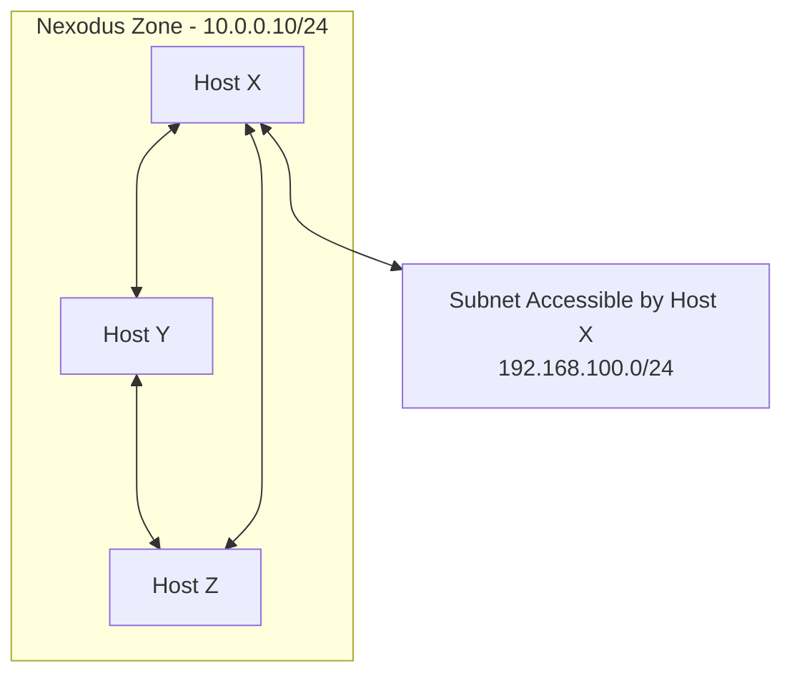

# Documentation

- [Documentation](#documentation)
  - [Concepts](#concepts)
  - [Deploying the Nexodus Controller](#deploying-the-nexodus-controller)
    - [Run on Kubernetes](#run-on-kubernetes)
      - [Add required DNS entries](#add-required-dns-entries)
      - [Deploy using KIND](#deploy-using-kind)
    - [HTTPS](#https)
  - [Using the Nexctl Utility](#using-the-nexctl-utility)
    - [Install pre-built binary](#install-pre-built-binary)
    - [Build from the source code](#build-from-the-source-code)
  - [Deploying the Nexodus Agent](#deploying-the-nexodus-agent)
    - [Deploying on Node](#deploying-on-node)
      - [Installing the Agent](#installing-the-agent)
        - [Install Script](#install-script)
        - [RPM from a Copr Repository](#rpm-from-a-copr-repository)
        - [Custom RPM Build](#custom-rpm-build)
        - [Systemd](#systemd)
        - [Starting the Agent](#starting-the-agent)
      - [Interactive Enrollment](#interactive-enrollment)
      - [Verifying Agent Setup](#verifying-agent-setup)
      - [Verifying Organization Connectivity](#verifying-organization-connectivity)
      - [Cleanup Agent From Node](#cleanup-agent-from-node)
    - [Deploying on Kubernetes managed Node](#deploying-on-kubernetes-managed-node)
      - [Setup the configuration](#setup-the-configuration)
      - [Deploying the Agent in the Kind Dev Environment](#deploying-the-agent-in-the-kind-dev-environment)
      - [Deploying the Nexodus Agent Manifest](#deploying-the-nexodus-agent-manifest)
      - [Controlling the Agent Deployment](#controlling-the-agent-deployment)
      - [Verify the deployment](#verify-the-deployment)
      - [Cleanup Agent Pod From Node](#cleanup-agent-pod-from-node)
  - [Deploying the Nexodus Relay](#deploying-the-nexodus-relay)
    - [Setup Nexodus Relay Node](#setup-nexodus-relay-node)
      - [Interactive OnBoarding](#interactive-onboarding)
      - [Silent OnBoarding](#silent-onboarding)
    - [Delete Organization](#delete-organization)
  - [Additional Features](#additional-features)
    - [Subnet Routers](#subnet-routers)
  - [Running the integration tests](#running-the-integration-tests)
    - [Prerequisites](#prerequisites)
    - [Using Docker](#using-docker)
    - [Using podman](#using-podman)

## Concepts

- **Zone** - An isolated network connectivity domain. Nexodus supports multiple, isolated Zones.
- **Controller** - The Controller is the hosted service that handles authentication, authorization, management of zones, enrollment of nodes, and coordination among nodes to allow them to peer with other nodes.
- **Agent** - The Agent runs on any node which wants to join an Nexodus Zone.

## High Level Solution Description

A high level summary of the overall solution is provided [here.](design/solution-architecture.md)

## Deploying the Nexodus Controller

### Run on Kubernetes

#### Add required DNS entries

The development Nexodus stack requires 3 hostnames to be reachable:

- `auth.nexodus.local` - for the authentication service
- `api.nexodus.local` - for the backend apis
- `nexodus.local` - for the frontend

To add these on your own machine for a local development environment:

```console
echo "127.0.0.1 auth.nexodus.local api.nexodus.local nexodus.local" | sudo tee -a /etc/hosts
```

#### Deploy using KIND

> **Note**
> This section is only if you want to build the controller stack. If you want to attach to a running controller, see [Deploying the Nexodus Agent](#deploying-the-nexodus-agent).

You should first ensure that you have `kind`, `kubectl` and [`mkcert`](https://github.com/FiloSottile/mkcert) installed.

If not, you can follow the instructions in the [KIND Quick Start](https://kind.sigs.k8s.io/docs/user/quick-start/).

```console
make run-on-kind
```

This will install:

- `nexodus-dev` kind cluster
- `ingress-nginx` ingress controller
- a rewrite rule in coredns to allow `auth.nexodus.local` to resolve inside the k8s cluster
- the `nexodus` stack

To bring the cluster down again:

```console
make teardown
```

### HTTPS

The Makefile will install the https certs. You can view the cert in the Nexodus root where you ran the Makefiile.

```console
cat .certs/rootCA.pem
```

In order to join a self-signed Nexodus controller from a remote node or view the Nexodus UI in your dev environment, you will need to install the cert on the remote machine. This is only necessary when the controller is self-signed with a domain like we are using with the nexodus.local domain for development.

Install [`mkcert`](https://github.com/FiloSottile/mkcert) on the agent node, copy the cert from the controller running kind (`.certs/rootCA.pem`) to the remote node you will be joining (or viewing the web UI) and run the following.

```console
CAROOT=$(pwd)/.certs mkcert -install
```

For windows, we recommend installing the root certificate via the [MMC snap-in](https://learn.microsoft.com/en-us/troubleshoot/windows-server/windows-security/install-imported-certificates#import-the-certificate-into-the-local-computer-store).

## Using the Nexctl Utility

`nexctl` is a CLI utility that is used to interact with the Nexodus Api Server. It provides command line options to get existing configuration of the resources like Zone, Peer, User and Devices from the Api server. It also allows limited options to configure certain aspects of these resources. Please use `nexctl -h` to learn more about the available options.

You can install `nexctl` using following two ways

### Install pre-built binary

You can directly fetch the binary from the Nexodus's AWS S3 bucket.

```sh
sudo curl -fsSL https://nexodus-io.s3.amazonaws.com/nexctl-linux-amd64 --output /usr/local/sbin/nexctl
sudo chmod a+x /usr/local/sbin/nexctl
```

### Build from the source code

You can clone the Nexodus repo and build the binary using

```sh
make dist/nexctl
```

## Deploying the Nexodus Agent

### Deploying on Node

The following sections contain general instructions to deploy the Nexodus agent on any node. The minimum requirement is that the node runs Linux, Darwin, or Windows-based Operating systems.

#### Installing the Agent

##### Install Script

The Nexodus agent (`nexd`) is run on any node that will join an Nexodus Zone to communicate with other peers in that zone. This agent communicates with the Nexodus Controller and manages local wireguard configuration.

The `hack/nexodus_installer.sh` script will download the latest build of `nexd` and install it for you. It will also ensure that `wireguard-tools` has been installed. This installer supports MacOS and Linux. You may also install `wireguard-tools` yourself and build `nexd` from source.

```sh
hack/nexodus_installer.sh
```

##### RPM from a Copr Repository

A Fedora [Copr repository](https://copr.fedorainfracloud.org/coprs/russellb/nexodus/) is updated with new rpms after each new commit to the `main` branch that passes CI. The rpm will include `nexctl`, `nexd`, and integration with systemd.

You can add this repository to your Fedora host with the following command:

```sh
sudo dnf copr enable russellb/nexodus
```

Then you should be able to install nexodus with:

```sh
sudo dnf install nexodus
```

##### Custom RPM Build

You can also build a custom rpm from the git repository. You must have `mock` installed to build the package.

```sh
make rpm
```

After running this command, the resulting rpm can be found in `./dist/rpm/mock/`.

To install the rpm, you may use `dnf`.

```sh
sudo dnf install ./dist/rpm/mock/nexodus-0-0.1.20230216git068fedd.fc37.src.rpm
```

##### Systemd

If you did not install `nexd` via the rpm, you can still use the systemd integration if you would like. The following commands will put the files in the right place.

```sh
sudo cp contrib/rpm/nexodus.service /usr/lib/systemd/service/nexodus.service
sudo cp contrib/rpm/nexodus.sysconfig /etc/sysconfig/nexodus
sudo systemctl daemon-reload
```

##### Starting the Agent

> **Note**
> In a self-signed dev environment, each agent machine needs to have the [imported cert](#https) and the [host entry](#add-required-dns-entries) detailed above.

You may start `nexd` directly. You must include the URL to the Nexodus service as an argument.

```sh
sudo nexd-linux-amd64 https://nexodus.local
```

Alternatively, you can start `nexd` as a systemd service. First, edit `/etc/sysconfig/nexodus` to reflect the URL of the Nexodus service. Then, start the agent with the following command:

```sh
sudo systemctl start nexodus
```

If you would like `nexd` to run automatically on boot, run this command as well:

```sh
sudo systemctl enable nexodus
```

#### Interactive Enrollment

If the agent is able to successfully reach the controller API, it will provide a one-time code to provide to the controller web UI to complete enrollment of this node into an Nexodus Zone. If you ran `nexd` manually, you will see a message like the following in your terminal:

```sh
Your device must be registered with Nexodus.
Your one-time code is: LTCV-OFFS
Please open the following URL in your browser to sign in:
https://auth.nexodus.local/realms/nexodus/device?user_code=LTCV-OFFS
```

If the agent was started using systemd, you will find the same thing in the service logs.

Once enrollment is completed in the web UI, the agent will show progress.

```text
Authentication succeeded.
...
INFO[0570] Peer setup complete
```

#### Verifying Agent Setup

Once the Agent has been started successfully, you should see a wireguard interface with an address assigned. For example, on Linux:

```sh
$ ip address show wg0
161: wg0: <POINTOPOINT,NOARP,UP,LOWER_UP> mtu 1420 qdisc noqueue state UNKNOWN group default qlen 1000
    link/none
    inet 100.100.0.1/32 scope global wg0
       valid_lft forever preferred_lft forever
```

#### Verifying Organization Connectivity

Once more than one node has enrolled in the same Nexodus organization, you will see additional routes populated for reaching other node's endpoints in the same organization. For example, we have just added a second node to this zone. The new node's address in the Nexodus organization is 100.100.0.2. On Linux, we can check the routing table and see:

```sh
$ ip route
...
100.100.0.2 dev wg0 scope link
```

You should now be able to reach that node over the wireguard tunnel.

```sh
$ ping 100.100.0.2
PING 100.100.0.2 (100.100.0.2) 56(84) bytes of data.
64 bytes from 100.100.0.2: icmp_seq=1 ttl=64 time=7.63 ms
```

You can explore the web UI by visiting the URL of the host you added in your `/etc/hosts` file. For example, `https://nexodus.local/`.

#### Cleanup Agent From Node

If you want to remove the node from the network, and want to cleanup all the configuration done on the node. Fire away following commands:

Ctrl + c (cmd+c) the agent process. and remove the wireguard interface and relevant configuration files.
*Linux:*

```shell
sudo ip link del wg0
```

*OSX/Windows:*

Since the wireguard agents are userspace in both Windows and Darwin, the tunnel interface is removed when the agent process exits.

### Deploying on Kubernetes managed Node

Instructions mentioned in [Deploying on Node](#deploying-on-node) can be used here to deploy the Nexodus agent on Kubernetes-managed nodes. However, deploying the agent across all the nodes in a sizable Kubernetes cluster can be a challenging task. The following section provides instructions to deploy Kubernetes style manifest to automate the deployment process.

#### Setup the configuration

Agent deployment in Kubernetes requires a few initial configuration details to successfully deploy the agent and onboard the node. This configuration is provided through `kustomization.yaml`. Make a copy of the sample `kustomization.yaml.sample`](../deploy/nexodus-client/overlays/dev/kustomization.yaml.sample) and rename it to `kustomization.yaml`.

Fetch the CA cert from the Kubernetes cluster that is running the Nexodus controller, and set the return cert string to `cert` literal of `secretGenerator` in `kustomization.yaml`.

```sh
kubectl get secret -n nexodus nexodus-ca-key-pair -o json | jq -r '.data."ca.crt"'
```

Update the `<nexodus_CONTROLLER_IP>` with the IP address where the Nexodus controller is reachable. If you are running the Nexodus stack in Kind cluster on your local machine, set it to the public IP of the machine.

**Note**
Current username and password are default configuration for development environment, which is very likely to change in near future.

You can refer to [kustomization.yaml.sample](../deploy/nexodus-client/overlays/dev/kustomization.yaml.sample) for an example manifest.

If you have setup your Nexodus stack with non-default configuration, please copy the [sample](./../deploy/nexodus-client/overlays/sample/) directory and update the sample file according to create a new overlay for your setup and deploy it.

#### Deploying the Agent in the Kind Dev Environment

If you're using the kind-based development environment, you can deploy the agent to each node in that cluster using this command:

```sh
make deploy-nexodus-agent
```

Then you may skip down to the [Verify the deployment](#verify-the-deployment) section.

Otherwise, if you are working with another cluster, continue to the next section.

#### Deploying the Nexodus Agent Manifest

Once the configuration is set up, you can deploy Nexodus's manifest files.

```sh
kubectl apply -k ./deploy/nexodus-client/overlays/dev
```

It will deploy a DaemonSet in the newly created `Nexodus` namespace. DaemonSet deploys a Pod that runs a privileged container that does all the required configuration on the local node. It also starts the agent and onboard the device automatically using the non-interactive access token based onboarding.

**Note**
If your Kubernetes cluster enforces security context to deny privileged container deployment, you need to make sure that the security policy is added to the service account `nexodus` (created for agent agent deployment) to allow the deployment.

#### Controlling the Agent Deployment

By default Nexodus agent is deployed using DaemonSet, so Kubernetes will deploy Nexodus agent pod on each worker node. This might not be the ideal strategy for onboarding Kubernetes worker nodes for many reasons. You can control the Nexodus agent deployment by configuring the `nodeAffinity` in the [node_selector.yaml](../deploy/nexodus-client/overlays/dev/node_selector.yaml).

The default behavior is set to deploy Nexodus pod on any node that is running Linux Operating System and is tagged with `app.kubernetes.io/nexodus=`. With this deployment strategy, once you apply the Nexodus manifest, Kubernetes won't deploy Nexodus pod on any worker node. To deploy the Nexodus pod on any worker node, tag that node with `app.kubernetes.io/nexodus=` label.

```sh
kubectl label nodes <NODE_NAME> app.kubernetes.io/nexodus=
```

If you want to remove the deployment from that node, just remove the label.

```sh
kubectl label nodes <NODE_NAME> app.kubernetes.io/nexodus-
```

If you want to change the deployment strategy for Nexodus pod, please copy the [sample](./../deploy/nexodus-client/overlays/sample/) directory to create a new overlay, and configure the  [node_selector.yaml.sample](../deploy/nexodus-client/overlays/sameple/node_selector.yaml.sample) file as per your requirements. After making the required changes rename the file to `node_selector.yaml` and deploy it.

Currently sample file provides two strategy to control the deployment, but feel free to change it based on your requirements.

1 ) Deploy Nexodus pod on any node that is tagged with `app.kubernetes.io/nexodus=`

```yaml
  - key: app.kubernetes.io/nexodus
    operator: Exists
```

2 ) Deploy Nexodus pod on specific node/s in the Kubernetes cluster. Uncomment the following lines in `node_selector.yaml.sample` and add the list of the nodes.

```yaml
# Deploy nexodus client on  specific nodes
#              - key: kubernetes.io/hostname
#                operator: In
#                values:
#                - <NODE_1>
#                - <NODE_2>
```

#### Verify the deployment

Check that nexodus pod is running on the nodes

```sh
kubectl get pods -n nexodus -o wide
```

Login to one of the nodes, and you should see a wireguard interface with an address assigned. For example, on Linux:

```sh
$ ip address show wg0
161: wg0: <POINTOPOINT,NOARP,UP,LOWER_UP> mtu 1420 qdisc noqueue state UNKNOWN group default qlen 1000
    link/none
    inet 100.100.0.1/32 scope global wg0
       valid_lft forever preferred_lft forever
```

#### Cleanup Agent Pod From Node

Removing the Nexodus manifest will remove the Nexodus pod and clean up WireGuard configuration from the node as well.

```sh
kubectl delete -k ./deploy/nexodus-client/overlays/dev
```

## Deploying the Nexodus Relay

Nexodus Controller makes best effort to establish a direct peering between the endpoints, but in some scenarios such as symmetric NAT, it's not possible to establish the direct peering. To establish connectivity in those scenario, Nexodus Controller uses Nexodus Relay to relay the traffic between the endpoints. To use this feature you need to onboard a Relay node to the Nexodus network. This **must** be the first device to join the Nexodus network to enable the traffic relay.

### Setup Nexodus Relay Node

Clone the Nexodus repository on a VM (or bare metal machine). Nexodus relay node must be reachable from all the endpoint nodes that want to join the Nexodus network. Follow the instruction in [Installing the agent](#installing-the-agent) section to setup the node and install the nexodus binary.

You can list the available organizations using following command

```sh
./nexctl  --username=kitteh1 --password=floofykittens organization list

ORGANIZATION ID                          NAME          CIDR              DESCRIPTION                RELAY/HUB ENABLED
dcab6a84-f522-4e9b-a221-8752d505fc18     default       100.100.1.0/20     Default Zone               false
```

#### Interactive OnBoarding

```sh
sudo nexodus --hub-router --stun https://nexodus.local
```

It will print a URL on stdout to onboard the relay node

```sh
$ sudo nexodus --hub-router --stun https://nexodus.local
Your device must be registered with Nexodus.
Your one-time code is: GTLN-RGKP
Please open the following URL in your browser to sign in:
https://auth.nexodus.local/device?user_code=GTLN-RGKP
```

Open the URL in your browser and provide the username and password that you used to create the zone, and follow the GUI's instructions. Once you are done granting the access to the device in the GUI, the relay node will be OnBoarded to the Relay Zone.

#### Silent OnBoarding

To OnBoard devices without any browser involvement you need to provide username and password in the CLI command

```sh
nexodus --hub-router --stun --username=kitteh1 --password=floofykittens https://nexodus.local
```

### Delete Organization

To delete the organization,

```sh
nexctl  --username=kitteh1 --password=floofykittens organization delete --organization-id b130805a-c312-4f4a-8a8e-f57a2c7ab152
```

## Additional Features

### Subnet Routers

Typically, the Nexodus agent runs on every host that you intend to have connectivity to an Nexodus Zone. However, there may be some cases where you can't do that or don't want to. It is also possible to make a host act as a Subnet Router to provide connectivity between an Nexodus Zone and a local Subnet the host has access to.

In the following diagram, `Host X` acts as a Subnet Router, allowing all hosts within Nexodus Zone A to access `192.168.100.0/24`.

To configure this scenario, the `nexd` agent on `Host X` must be run with the `--child-prefix` parameter.

```sh
sudo nexd --child-prefix 192.168.100.0/24 [...]
```

The subnet exposed to the Nexodus Zone may be a physical network the host is connected to, but it can also be a network local to the host. This works well for exposing a local subnet used for containers running on that host. A demo of this containers use case can be found in [scenarios/containers-on-nodes.md](scenarios/containers-on-nodes.md).

> **Note**
> Subnet Routers do not perform NAT. Routes for hosts in `192.168.100.0/24` to reach Nexodus Zone A via `Host X` must be handled via local configuration that is appropriate for your network.



## Running the integration tests

### Prerequisites

Prior to running the integration tests, you must start the kind-based development environment. See the [Run on Kubernetes](#run-on-kubernetes) section for further details.

### Using Docker

You can simply:

```console
make e2e
```

### Using podman

Since the test containers require CAP_NET_ADMIN only rootful podman can be used.
To run the tests requires a little more gymnastics.
This assumes you have `podman-docker` installed since testcontainers relies on mounting `/var/run/docker.sock` inside the reaper container.

```console
# Build test images in rootful podman
sudo make test-images
# Compile integration tests
go test -c --tags=integration ./integration-tests/...
# Run integration tests using rootful podman
sudo APEX_TEST_PODMAN=1 TESTCONTAINERS_RYUK_CONTAINER_PRIVILEGED=true ./integration-tests.test -test.v
```
