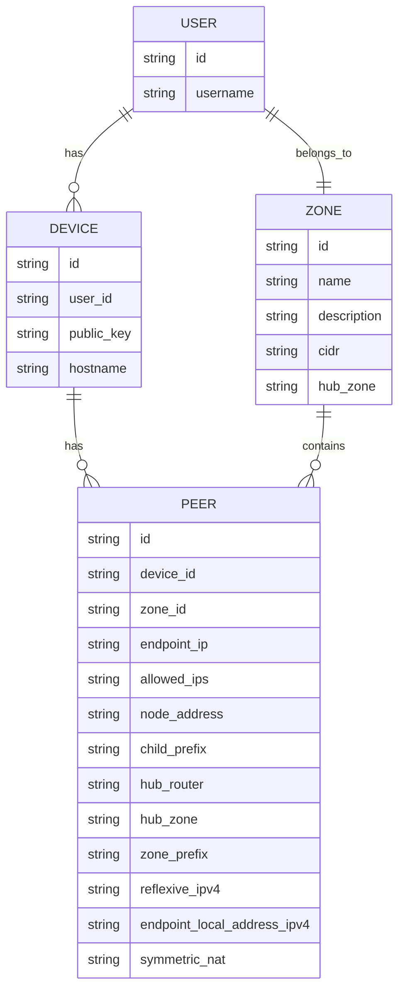
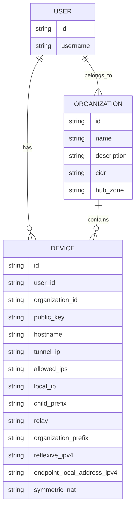

# Database Schema

## v1: PoC

In v1, the schema looks as follows:

We have 4 concepts:

- Users: Unique users of the service
- Devices: A unique end-user device
- Zone: A way of describing which devices may communicate with eachother
- Peer: An association between a Device and a Zone. This is used by the nexodus agent to identify who it may peer with.

Since connectivity was Zone-based, we would create a "Default Zone" where all devices would be onboarded into. Adding > 1 Zone was disabled, since there were technical challenges around moving a device from one Zone to another, or for a device to have peers in > 1 Zone.

The device-onboarding flow was as follows:

1. Operator/Customer sets up OIDC to provide users with access to Nexodus
1. User runs the Nexodus agent
1. Nexodus agent does a `POST /device` to register the unique device with Nexodus for the user. It is assigned into the single zone that a user is in (either the default zone, or a new zone where the user was moved to by an admin).
1. Once the device is registered a `POST /zones/$id/peers` was issued to create an association between this device and a zone.
1. `GET /zones/$id/peers` was polled to retrieve the peer listing for a zone.

On top of this flow, we were somewhat abusing `POST /zones/$id/peers` to also update peers after NAT-T.

This model was built under the assumption that multi-tenancy would be achieved by deploying an Nexodus stack per-tenant.

## v2: SaaS Preview Milestone

See [issue #348](https://github.com/nexodus-io/nexodus/issues/348).

In order to create a more SaaS-ready schema, we've made the following changes.

1. Replace the `Zone` construct with `Organization`. This is a GitHub-like construct, where each unique `User` is also its own `Organization`.
1. Deprecate `Peer` and combine it's functionality with the `Device` table.

In this simplified model we only have 3 concepts:

- Users: Unique users of the service
- Devices: A unique end-user device
- Organization: A collection of users who have permissions to onboard one or more devices into this organization

Since a `User` is also an `Organization`, once someone has registered to Nexodus we onboard devices into their personal organization.

The device-onboarding flow is as follows:

1. A User registers for Nexodus using a sign-up form on <https://try.nexodus.io/>, with the option to use SSO from Google, Github, Facebook etc..
1. User downloads and runs the Nexodus agent
1. Nexodus agent does a `POST /device` to register the unique device with Nexodus for the user - it's onboarded into their personal organization.
1. `GET /organization/$id/devices` is polled to retrieve the peer listing for a zone.
1. An dedicated API endpoint was added to update device information if the public-facing address changes etc...

A key point here is that there is no admin intervention required to onboard a new user as anyone can sign-up and register.

Supporting a user belonging to multiple organizations is easy in this model since a `Device` may only be in one `Organization` at a time. A `User` may chose to move their device at any time, although this functionality will not be implemented during the transition from v1->v2.
