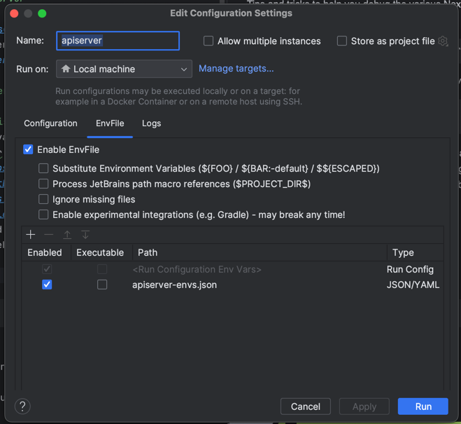

# Debugging Nexodus

Tips and tricks to help you debug the various Nexodus components.

## About Telepresence

Developing services deployed in Kubernetes can be tricky since it can be a bit slow to deploy changes into Kubernetes and even hard to remote debug.  Telepresence allows you to reroute network traffic going in and out of a pod to your local machine so that you can more easily have a fast development loop of the software running in that pod.

Many of the tips in this document require you to first install [telepresence](https://www.telepresence.io/).   O

## Debugging/Developing the `apiserver`

Once you have the Nexodus service [running in Kind](../deployment/nexodus-service.md#deploy-using-kind), run:

    make debug-apiserver

This will create a `apiserver-envs.json` file that contains all the environment variables that you should set when your run the apiserver locally with a debugger.  If your using an [GoLand](https://www.jetbrains.com/go/) or [IDEA](https://www.jetbrains.com/idea/) ide, install the [EnvFile Plugin](https://plugins.jetbrains.com/plugin/7861-envfile).  This will allow you automatically read and set the environment variables up when you launch and debug the api server.



Once you run the `apiserver` locally, requests against that Nexodus service should result in http requests being executed against your locally running `apiserver`.

To stop routing traffic from the apiserver pod to your machine, run:

    make debug-apiserver-stop

## Debugging/Developing the `frontend`

Once you have the Nexodus service [running in Kind](../deployment/nexodus-service.md#deploy-using-kind), run:

    make debug-frontend

This will start a development vite server locally so that any local changes to the ui sources can instantly reloaded in your browser.  
This uses Telepresence, so ignore the URLs on the screen from vite, and instead connect to [https://try.nexodus.127.0.0.1.nip.io/](https://try.nexodus.127.0.0.1.nip.io/)

To stop routing traffic from the frontend pod to your machine, run:

    make debug-frontend-stop

## Profiling nexd

To profile the performance of `nexd`, build it with `pprof` support enabled. If you run `make all`, you can use the `dist/nexd-pprof` binary. If you need to build for a specific and platform and architecture, you can set `NEXODUS_PPROF=y` and have `pprof` enabled in all binaries:

```sh
NEXODUS_PPROF=y make all
```

This also works for building the `nexd` container image.

```sh
NEXODUS_PPROF=y make image-nexd
```

Once pprof is enabled, `nexd` will expose performance data over http port `8080`. To change this port, set the `NEXD_PPROF_PORT` environment variable.

To capture performance data and browse the results in a web interface, run this command:

```sh
go tool pprof -http=: http://<NEXD_HOST>:8080
```

A flame graph is available by navigating to `View > Flame Graph` in the web UI. Browse around for the other resources that are available.
