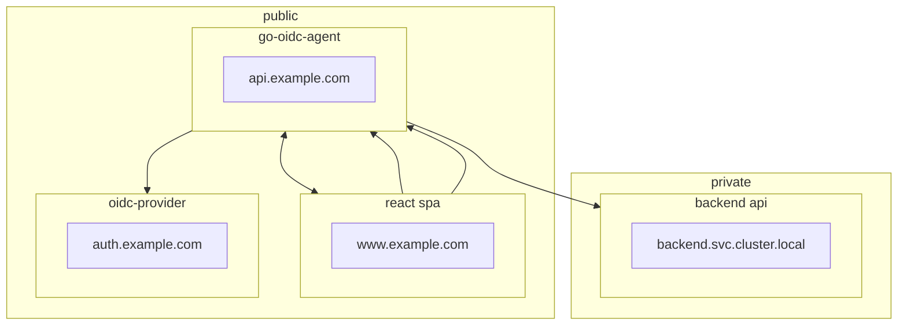

# Authentication

The Nexodus Stack uses OpenID Connect for authentication.
It allows whomever deploys the stack to chose any OpenID connect provider they wish in order to provide user authentication.
It also enables Nexodus to focus on its core, and to defer authentication to another service.

## go-oidc-agent

Nexodus authentication goes through a service called [go-oidc-agent](https://github.com/nexodus-io/nexodus/pkg/oidcagent). This service is an implementation of the Backend-For-Frontend (BFF) architecture.

This service:
1. Prevents tokens being compromised by ensuring that the browser has no access to them.
1. Doesn't require OIDC endpoints to be hard-coded in the frontend code.
1. Proxies request to the apiserver, adding a Bearer token if we're authenticated.

For more information on this flow see:

- <https://github.com/nexodus-io/nexodus/pkg/oidcagent>
- <https://auth0.com/blog/backend-for-frontend-pattern-with-auth0-and-dotnet/>
- <https://curity.io/resources/learn/the-token-handler-pattern/>

### Web Authentication Flow

Caddy proxy redirects traffic from Web User-Agents to an instances of go-oidc-agent running in Auth Code Flow mode.

The following endpoints are exposed by go-oidc-agent in this mode:

- `/login/start` stores state and nonce in a SameSite cookie, and returns the URL that the user must be redirected to in order to complete the flow.
- `/login/end` is the endpoint that the user should get redirected to AFTER they have logged in with their OIDC provider. This completes the OIDC flow by exchanging the `code` we were given by the provider for an `access_token`, `refresh_token` and `id_token`.
- `/userinfo` allows the frontend to request information about the currently logged-in user
- `/logout` logs the user out
- `/claims` returns the claims of the `access_token`
- `/refresh` refreshes the `access_token`

### CLI Authentication

Caddy proxy redirects traffic from CLI User-Agents to an instances of go-oidc-agent running in Device Flow Mode.

In this mode only one endpoint is provided: `login/start`
This returns:
1. The Device Authorization Endpoint of the Authenication Server
1. The Client ID to use
1. The Issuer URL, for use in Resource Owner Password Grant Flows

This avoid us hard-coding OIDC endpoints into the `nexd` binary.
The Nexodus CLI is then responsible for acquiring and storing tokens.

## Apiserver Authentication

The apiserver expects to see JWTs provided as a Bearer token in the `Authorization` header, and will validate the JWT signature against the OpenID Providers JWKs to verify that it hasn't been tampered with.
