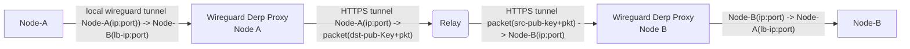

# DERP Relay Integration with Nexodus

Nexodus needed a more secure alternative to relay the traffic between peers behind symmetric NAT. DERP based relay was considered as an alternative that satisfied the security requirements of the end to end packet relay.

Following were the high level requirements considered on how does the DERP Relay should work in the Nexodus deployment:

- Nexodus would like to maintain support for the existing wireguard based relay, possibly without any change in the functionality.
- Nexodus wants to give seamless out of the box experience for connecting the peers behind the symmetric NAT (without any prerequisite of setting up the relay).
- Nexodus would also like to provide an alternate option to onboarding the DERP relay to specific VPC in case users don't want to use the publicly hosted DERP relays.
- Onboarding of the private DERP Relay must use the same control flow as the wireguard relay for consistent user experience. - User might or might not want to use the public DNS to resolve their private relay.
- Avoid creating separate binaries for DERP relay to minimize the number of binaries users need to deal with.

Current design took following assumptions as well for integrating the DERP relay:

- Initial version will support only a single public relay, currently hosted at relay.nexodus.io.
- To support multiple relays we need to implement a control plane admin API to add the public relays.
- Only one on-board relay is supported (irrespective of the type of relay)- private relay (Wireguard or DERP) will take precedence if available, over public Relay, because on-boarding the private relay is intentional.

Considering the above requirements and assumptions for the initial version of integration, DERP relay supports two versions - Publicly hosted relay and on-boarded relay. More details about these relay deployments can be found in the [DERP Relay](../../user-guide/relay-nodes.md#deploying-nexodus-relay-nodes) section of the user guide.

Following sections describe the internal working of both the deployment models of the DERP Relay.

## Public DERP Relay Control Flow

- Nexodus project has its default public DERP Relay deployed at [relay.nexodus.io](relay.nexodus.io), and all the nexodus agents are aware of it (Default meta information is hardcoded in nexd agent).
- When nexd agent receives a peer behind symmetric NAT, and if no **healthy on-boarded** relay is present (Wireguard or DERP), it attempts to connect through the public derp relay by making connection to relay.nexodus.io.
- Given that the peer behind symmetric NAT will also attempt to connect through the DERP Relay, it eventually becomes aware of both the peers (source and destination) and that enables the traffic relay between them.

## On-boarded DERP Relay Control Flow

Irrespective of the way (public or private DNS) user setup and on-board the private DERP relay, the control flow from nexd agent perspective is the same. The overall control flow has two parts:

### On-boarding the Relay

- Users start the private relay with the cli option `--hostname` value set to the DNS that resolves to the public IP where relay is running.
- Nexd agent set the following metadata for the device using update-device-metadata Device API call after device onboard successfully .
  - **type** : Type of the relay (derp or wireguard), determined based on the subcommand (`relay` and `relayderp`)
  - **hostname**: Provided DNS name that resolves to the public IP address where relay is hosted
  - **certmodemanual**: Set to true if relay is on-boarded with private DNS & user created certificates.
- Once a relay is successfully on-boarded using the usual device on-boarding control flow, every peer in the VPC receives the relay as a peer and has access to relay's metadata information.
- Given that nexd agent uses a stun request to determine the reflexive ip address of the relay and it is shared to all the peers, every peer also knows the IP address where relay is reachable and the DNS (public or private) will resolve to.

### Forwarding packet to the relay

When peer receives a node that is relay, it uses get-device-metadata device API to fetch the device metadata (type, hostname, certmodemanual). If the relay is of type `derp` and nexd agent receives a peer that is behind symmetric NAT, it establishes connection to the `hostname` and forward traffic to the relay.

If the on-boarded relay is using public DNS (`certmodemanual : false`), this control flow works out of the box just like publicly hosted relay because the DNS provider will resolve the DNS to the relay IP address and also provide all the necessary certificates to establish the secure connection.

If the on-boarded relay is using private DNS (`certmodemanual : true`), that means the DNS won't be resolved automatically. Nexd agent adds the DNS entry in the host `/etc/hosts` that points to the reflexive ip address of the on-boarded relay. Assuming the user did the correct certificate configuration and root CA setup by following the instructions in the [user guide](../../user-guide/relay-nodes.md#using-private-dns-name), it should be able to successfully establish a secure connection.

## Capturing wireguard packets to relay

Given that nexd uses kernel mode wireguard (for unix) and userspace wireguard (for darwin, windows), nexd implements a generic approach to capture the packet from the Wireguard interface that works for both implementations. Nexd does the following configuration to capture the wireguard packet destined to the peer behind symmetric NAT:

- For each peer behind symmetric NAT, nexd agent configures the peer in wireguard configuration with `endpoint` set to ip from the loopback ip range `127.0.0.0/8`. Following is the example of the configuration:

```text
peer: lnIu207t8fp/5TphE2ycJccUk0Bs4jXtrBNXwT9Cdy4=
  endpoint: **127.0.0.3:9002**
  allowed ips: 100.64.0.5
  transfer: 0 B received, 888 B sent
  persistent keepalive: every 20 seconds

peer: 538+xcbrPb1tva9+azyXSVbuScX571iBuVHMj2t1GHo
  endpoint: **127.0.0.4:9002**
  allowed ips: 100.64.0.6
  transfer: 0 B received, 2.17 KiB sent
  persistent keepalive: every 20 seconds
```

Given the endpoint is the loopback ip address, wireguard driver sends packet to the loopback ip address to the given port. Nexd internally runs the wireguard-derp proxy that listens on the given port on the loopback interface. Once the UDP packet is received by the proxy, it determines the destination IP address (loopback IP configured for the peer) from the header.

Nexd internally maintains the mapping of wireguard public key and the loopback IP address assigned to the peer, so it uses that mapping to determine the wireguard public key for the destination peer using the extracted loopback IP from UDP packet. Nexd creates the DERP message using the destination peer's public key and sends the packet over the HTTPS/TLS connection to the relay.

When any peer connects to the DERP relay, it learns the public key of the peer during handshake. Once a relay receives the packet over a connection, it forwards the packet based on the destination public key it received in the message and also sends the source public key in the derp message. At the destination peer, wireguard-derp proxy checks the source public key and determines the loopback ip address assigned to the source peer, and writes the packet to the wireguard interface after SNAT.


