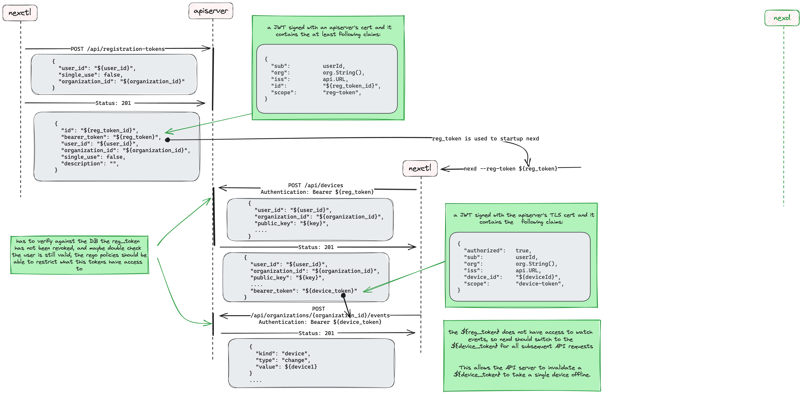

# Device registration flow using a registration token

> [Issue #1209](https://github.com/nexodus-io/nexodus/issues/1209)

## Summary

* Device registration through user managed registration token.
* Support non-browser authorization flow
* Support disconnecting individual devices from the admin control plane.

## Proposal

### Problem

Currently, devices are registered on behalf of users using the user and password. If I register 3 devices using the admin user, I will see three sessions against the admin user.  Furthermore, the device has the user access token stored, so it has access to recreate a device so the admin control plane can't really stop the device from going online again.

### Solution

The apiserver will generate registration JWT tokens that can be used to onboard new devices and also per device JWT tokens that will be used per device to access the apiserver.  APIs will be provided to the user so he can revoke those JWT tokens.

#### Steps to register device

1. Create a registration token: .
    1. command: `nexctl registration-token create --exp date`
    2. Write down the registration token, you will need it to startup nexd.
2. Start nexd with the registration token:
    1. command: `nexd --registration-token {token}`
       1. nexd will use the registartion token as an API Bearer token, it only has access to create a device or update a device that token has previously created.
       2. the apiserver will return a new device token in the `bearer_token` field of the device.  nexd should store the device token to disk and use that token for a all future API calls.  The device token has access to all the API operations that a nexd client requires.

### Notes

Since a JWT is still being used to auth the API calls, and the same "sub" claim is present on apiserver created JWTs as the normal Oauth access tokens and therfore can be used by the apiproxy to rate limit the user the same way.

## Alternatives Considered

* Use KeyCloak dynamic client registration to create a Oauth client per user device.  The problems with this approach are that #1: it would tightly couple the apiserver to KeyCloak.  #2 It would only solve being able to disconnect a registered device.  Onboarding the device would still require an authentication flow so that we could control who is creating devices.

## References
