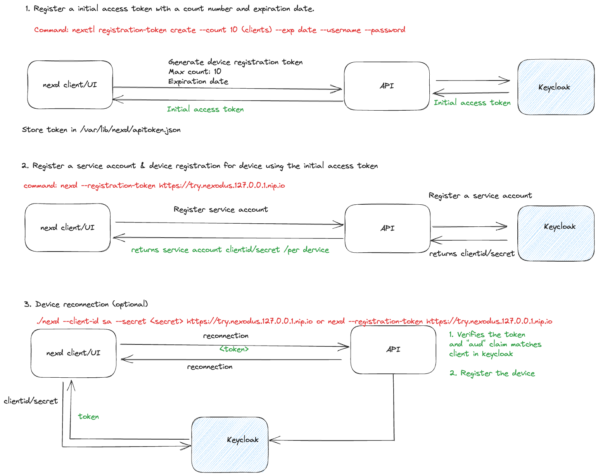
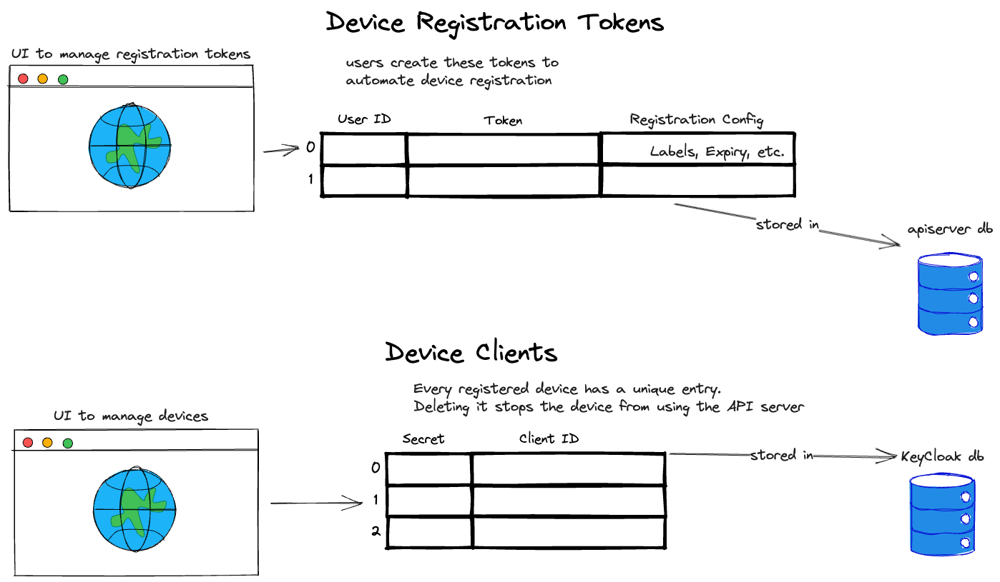

# Device registration flow using dynamic client registration in keycloak

> [Issue #1209](https://github.com/nexodus-io/nexodus/issues/1209)

## Summary

* Device registration through access a token
* Support non-browser authorization flow to allow
* Client representation for per device in Keycloak

## Proposal

### Problem

Currently, devices are registered on behalf of users using the user and password. If I register 3 devices using the admin user, I will see three sessions against the admin user. It will be challenging to differentiate the device request for authentication and maintain sessions.

### Solution

With the help of the [keycloak dynamic client registration](https://medium.com/keycloak/dynamic-client-registration-in-keycloak-4dd1c5cd5e69) feature, I am proposing to generate an initial access token with a configurable max count and expiration date.

#### Steps to register device

1. Register a initial access token with a count number and expiration date.
    1. command: `nexctl registration-token create --count 10 (clients) --exp date --username --password`
    2. Store the intial access token in `/var/lib/nexd/apitoken.json`
2. Register a service account & device registration using the initial access token
    1. command: `nexd --registration-token https://try.nexodus.127.0.0.1.nip.io`
    2. Store the client-id and client-secret in `/var/lib/nexd/apitoken.json`
3. When Nexd is restarted, load the client id/secret stored previously. As a result, nexd can be started with the same arguments every time.
4. Device reconnection (optional)
    1. command: `nexd --clientid <sa> --secret <secret> https://try.nexodus.127.0.0.1.nip.io`

### Data model requirments

* Table 1 will store the initial access token with a max count for the number of devices that can be registered, expiration date, and user id.
* For client id/secret are stored in the keycloak db out of the box feature

## Alternatives Considered

*Document any alternatives that were considered other than what was proposed.*

## References

*Leave links to helpful references related to this proposal.*