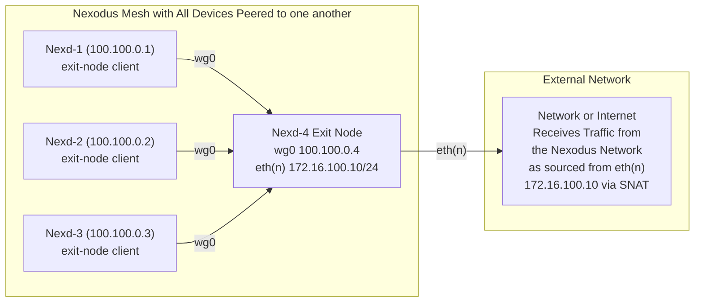
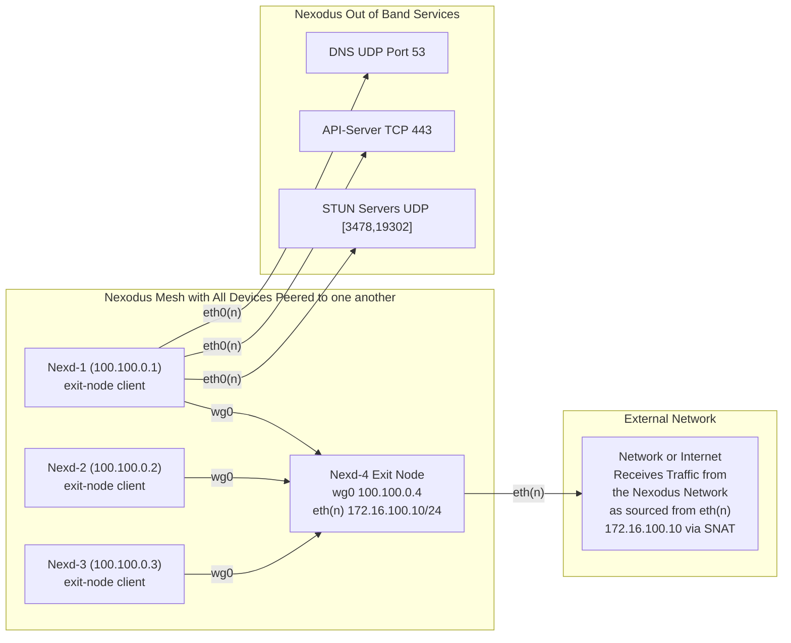

# Exit Node Support

## Summary

This document proposes exit node functionality in Nexodus. An exit node in the context of Nexodus is where traffic from a device will drain to a designated Nexodus agent via a peering and default route associated with the Nexodus exit node.

## Proposal

The initial scope of work is for Linux only. There are two main components, the exit node which originates all traffic leaving the Nexodus mesh and the exit node client which subscribes to the exit node service.

### Exit Node

- An exit node is a node that is advertising the network address `0.0.0.0/0`, the default route CIDR notation. Other devices in the organization are able to identify an exit node based on it advertising a default route prefix. The initial implementation is not adding any database fields to the API server schema.
- One additional flag is required to make sure a user intends on originating a default route that will forward traffic from a nexd driver interface such as `wg0` to another port such as `eth0`. The `--exit-node` flag also informs the agent to perform source NAT for traffic leaving the Nexodus mesh to allow return traffic to return to the originating exit-node and then sent back to the pre-nat source device.
- To begin with, there will be at most one active exit node per organization (or once a VPC/slice capability is implemented). Looking forward, the exit-node client should have the ability to choose from multiple exit nodes in an organization or slice of an organization and choose from multiple exit nodes based on the user's criteria, such as latency or geolocation. Since these are default routes that overlap being advertised to the mesh, the driver implementation will dictate whether more than one exit node can be concurrently active. In the case of the Wireguard driver, a peer's public key is associated to the route, so it is not possible to overlap prefixes.
- The exit node startup would look like the following example:

```shell
nexd router --exit-node
```

### Exit Node Client

- In order for a client to use the exit node, the user will need to explicitly subscribe to the exit node. Since exit nodes can be disruptive to the user's connection by tunneling all traffic to the exit node, it makes sense to have the extra step needed to explicitly join an exit node. The user can join via `nexctl`, via the web UI, or via a command-line argument to `nexd`.

An example workflow of an agent node looks like the following (open to adding client to the command):

```shell
# exit node reflexive address = x.227.102.183
# exit node client reflexive address = x.31.152.254

# Before enabling exit-node on the client
$ wget -qO - icanhazip.com
x.31.152.254

$ sudo nexctl nexd exit-node enable
Successfully enabled exit node client on this device

$ sudo nexctl nexd exit-node list
ENDPOINT ADDRESS         PUBLIC KEY
x.227.102.183:44728     6/CwH/gzz9jdKnxeVpWFivycFQMBkniLeBNFQq0+f04=

# After subscribing to the exit-node, the client is now originating traffic from the exit node.
$ wget -qO - icanhazip.com
x.227.102.183

# Next disable the exit node client.
$ sudo nexctl nexd exit-node disable
Successfully disabled exit node client on this device

# After unsubscribing the exit node client from the exit node server, you will now be sourcing your traffic from the original reflexive address.
$ wget -qO - icanhazip.com
x.31.152.254
```

There will also be a runtime flag that can enable a device to be an exit node client in the form of a global flag of `--exit-node-client`. The client side functionality can still be enabled and disabled via `nexctl` as shown above.

```text
nexd --exit-node-client
```

A diagram of the traffic flow is as follows:



### Client Out of Band Services

Since all traffic is being tunneled there is a high likelihood that at some point the device will lose connectivity to the exit node and become orphaned. Because of that, we are baking in as many safeguards as possible and options to recover connectivity.

1. Nexodus servi1. Traffic to Nexodus services will travel out of band via the device's interface containing a default route via Linux policy routing. A new routing table is created with a default route pointing to the same default route in the default namespace. Then, using combinations of nftables and rules in the Linux RPDB (routing policy database), traffic destined for the OOB services is mangled and forwarded, bypassing the Nexodus driver interface (for example wg0). The initial out of band services are:
   - HTTPS port 443 to the API server's destination IP(s). If an exit node becomes unavailable, the exit node client device would no longer be able to reach the device. This would orphan the node and require a user to run nexctl to disable the exit node subscription. To allow an administrator or user of many devices to be able to dis-enroll a device from the web UI, we need to maintain API server connectivity even if an exit node is unavailable.
   - DNS UDP 53. This should likely be discovered via host discovery. There could potentially be scenarios where a DNS is only available via the Nexd mesh but that would be fairly atypical and should be tackled with Nexodus DNS implementation. This rule could also be narrowed if there was a host entry added to the device the agent is running on.
   - STUN requests on using UDP 19302 for the custom Google STUN ports. The RFC defined STUN port 3478 would not be modified. This is required because once a device is forwarding all traffic through the exit node, the reflexive address for the client device would take on the same reflexive address of the exit node.
2. To enable forwarding if the driver interface is down, A routing table with a default route to the driver interface such as wg0 is created. A forwarding mark is added to the driver of `51820` to denote Wireguard that says, if a packet does not have the firewall mark 51820, perform a lookup in the routing table 51820. Inside routing table 51820 is a default route pointing to wg0.

A diagram of the OOB services is as follows:



### Nexd Proxy Mode

TODO - russellb to fill this out later (tl;dr - it should be easy)

## Alternatives Considered

- We could take a namespace approach but that requires moving physical interfaces into namespaces which can be pretty invasive on a machine. The proposed approach makes teardown as simple as removing a netfilter table and two routing tables with a few policy routing rules.
- For Darwin support, we will need to take a path of granular routes which is more invasive and less flexible for out-of-band services than we can achieve with native Linux routing capabilities, but it could be considered an alternative option. It will require some Darwin networking research to try and send the stun through a policy-based route. An exit node being Linux only seems reasonable for now. Below is an example:

```plaintext
ifconfig utun3 up
route -q -n add -inet 0.0.0.0/1 -interface utun8
route -q -n add -inet 128.0.0.0/1 -interface utun8
route -q -n add -inet <peer address> -gateway <eth0 gateway>
```
