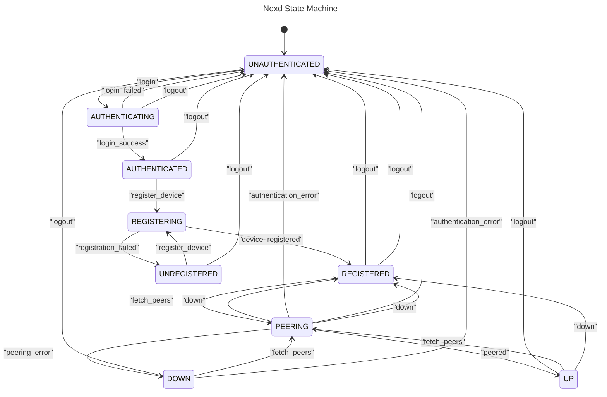

# Nexd State Machine

> [Issue #885](https://github.com/nexodus-io/nexodus/issues/885)

## Summary

State management in nexd is becoming more complicated.
We need a mechanism to allow us to simplify that logic and not rely on crash/restart to retrigger things.

## Proposal

I propose that we implement a Finite State Machine inside of nexd that operates as follows:

nexd may be in one of these states:

1. UNAUTHENTICATED: No configuration has been provided
1. AUTHENTICATING: Performing authentication, either interactively or via token
1. AUTHENTICATED: User is succesfully authenticated
1. UNREGISTERED: Authenticated but device has not been registered with the control plane
1. REGISTERED: Device is registered with the control plane, but data plane is not established
1. PEERING: Device is connected to control plane and fetching peer listings
1. UP: Data plane is established

To provide information to the user about the current state, a `nexctl nexd status` command will be updated to include the new states. This can inform the user of the current state and what to do next.

To transition from UNAUTHENTICATED to AUTHENTICATING the "login" transition must occur.

The trigger for this will be a either:

- Automatic at startup, either using provided credentials, or by starting the OTP login flow
- Automatic any time UNAUTHENTICATED was reached not as the result of an explicit logout request from the admin.

Once in the AUTHENTICATING state, credentials will be taken from the user if not provided in configuration. In event of successful login the "login_success" transition occurs to bring nexd into the AUTHENTICATED state.

When in the AUTHENTICATED state we will immediately try to register the device with the control plane by issuing a "register_device" transition, proceeding on success to the REGISTERED state.

From the REGISTERED state we automatically proceed to PEERING via a "fetch_peers" transition. This will fetch the list of peers from the control plane and attempt to establish a connection to each of them. If this succeeds, we will transition to the UP state.

In each state, we have transitions to handle the many error cases, for example:

1. A user wants to "pause" the mesh connection - pulling down the data plane elements but leaving the control plane connection intact.
1. A user wants to logout
1. There is an error in the authentication process
1. There is an error in the registration process
1. There is an error in the peering process

While not currently in the design, it is possible with this architecture to add another state that would be adjacent to UP called DEGRADED. We would enter this state when a tunnel keepalive fails and we are unable to re-establish the tunnel. This would allow us to notify the user that the mesh status is degraded and that they should take action.

## Alternatives Considered

Unfortunately I don't see any other alternatives here.
