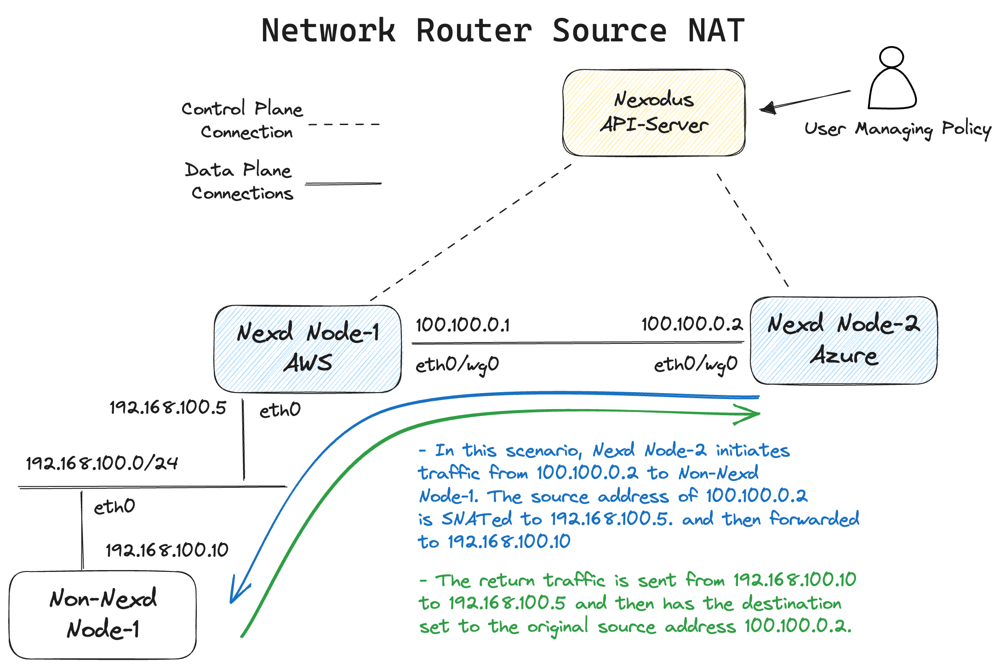
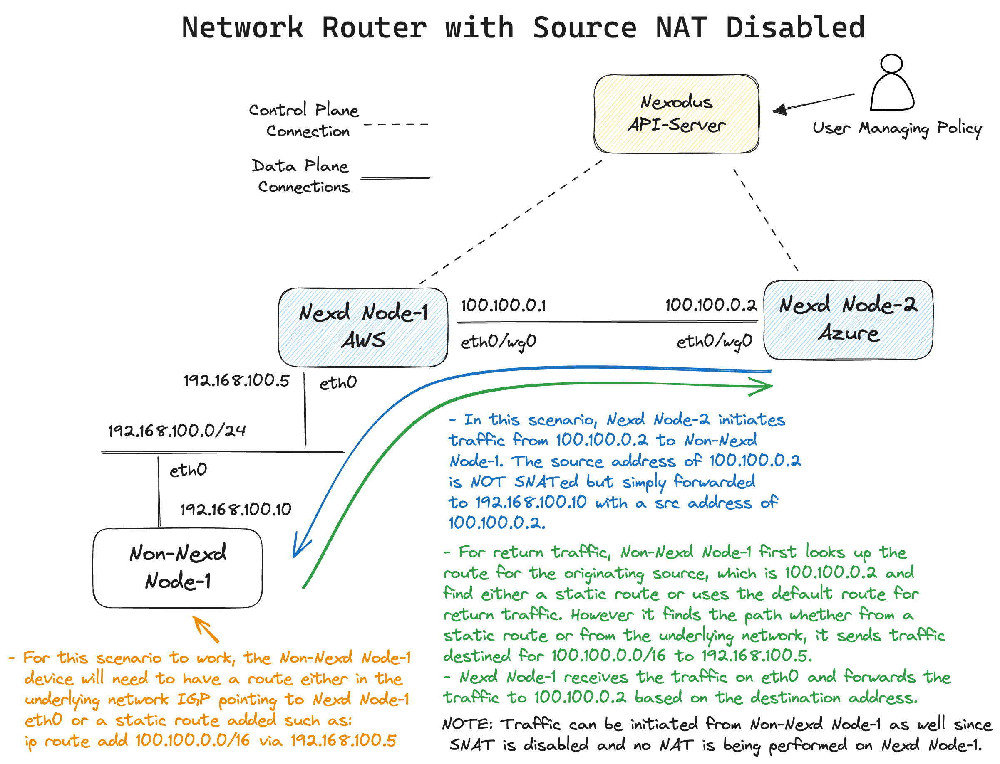

# Network Router

> Additional details and running code in [PR #981](https://github.com/nexodus-io/nexodus/pull/981)

## Summary

Add the ability for devices running nexd to access non-nexd devices and act as a router for external networks.

## Proposal

There are two supported use cases.

1. [Network Router with SNAT](#network-router-with-snat): Traffic from the Nexd mesh can reach external non-nexd nodes via source NAT without any configuration required.
2. [Network Router with SNAT disabled](#network-router-with-snat-disabled): Traffic from the Nexd mesh can reach external non-nexd nodes but external nodes require a route to be added for return traffic since SNAT is disabled.

With SNAT disabled, a user can initiate traffic from external, non-nexd devices to initiate traffic in to the nexodus mesh.

### Network Router with SNAT

This is a zero touch provisioning for the non-nexodus device since the edge nexd device will be source natting the traffic.

```shell
nexd --username admin --password floofykittens --service-url https://try.nexodus.127.0.0.1.nip.io \
    router --advertise-cidr 192.168.100.0/24 --network-router  
```

The advertise-cidr subnet specified will get distributed to all Nexodus peers. Those peers will get a route with a next hop of the Wireguard interface. In the following, you can view the advertise-cidr routes in the routing tables of nexd-node2 in the diagram.

```shell
# Linux
$ ip route | grep wg0
192.168.100.0/20 dev wg0
100.100.0.1 dev wg0
100.100.0.2 dev wg0
```

Here is an example with text diagramming a packet flow.



The nftables configuration for this scenario look as follows:

```text
table inet nexodus-net-router {
    chain prerouting {
        type nat hook prerouting priority dstnat; policy accept;
    }

     chain postrouting {
        type nat hook postrouting priority srcnat; policy accept;
        oifname "eth0" counter packets 3 bytes 230 masquerade
    }

    chain forward {
        type filter hook forward priority filter; policy accept;
        oifname "eth0" ip daddr 192.168.100.0/24 counter packets 0 bytes 0 accept
    }
}
```

### Network Router with SNAT disabled

There are additional configurations required to make this scenario work:

- The non-nexd node needs to have a route, either static or from the underlying IGP pointing to the ingress interface on the nexd edge node.
- It is common for there to be source/destination traffic checking enabled and blocked by default on cloud provider instances. For example, on EC2, one would need to disable [source / destination check](https://docs.aws.amazon.com/AWSEC2/latest/UserGuide/using-eni.html#modify-source-dest-check). The rest of the IP forwarding enablement is managed by the nexd agent.

To configure this scenario add a route on the non-nexd device for the nexodus network prefix:

```shell
sudo ip route add 100.100.0.0/16 via 192.168.100.5
```

Start the daemon with the additional `--disable-nat` parameter:

```shell
nexd  --username admin --password floofykittens router --advertise-cidr 192.168.100.0/24 --network-router --disable-nat  https://try.nexodus.127.0.0.1.nip.io
```

The advertise-cidr subnet specified will get distributed to all Nexodus peers. Those peers will get a route with a next hop of the Wireguard interface. In the following, you can view the advertise-cidr routes in the routing tables of nexd-node2 in the diagram.

```shell
# Linux
$ ip route | grep wg0
192.168.100.0/20 dev wg0
100.100.0.1 dev wg0
100.100.0.2 dev wg0
```

Here is an example with text diagramming a packet flow.



The nftables configuration for this scenario look as follows:

```text
table inet nexodus-net-router {
    chain prerouting {
        type nat hook prerouting priority dstnat; policy accept;
    }

    chain postrouting {
        type nat hook postrouting priority srcnat; policy accept;
    }

    chain forward {
        type filter hook forward priority filter; policy accept;
        oifname "eth0" ip daddr 192.168.100.0/24 counter packets 1049 bytes 88116 accept
    }
}
```

### Security Considerations

- Since devices are forwarding traffic from non-nexodus devices, nexodus restricts the allowed traffic to the IP prefix specified in the `--advertise-cidr`. This prevents arbitrary hosts from gaining access to the nexodus device peers.
- Additional compensating controls can be added via nexodus security groups to further restrict what traffic is permitted to be allowed in or out of the peerings from non-nexd devices.

## Future Enhancements

- Add a future enhancement idea of a flag that allows routing traffic into a Nexodus network with SNAT but without specifying any prefixes to advertise. This would allow a user to use Nexodus as a router for external traffic without having to specify any prefixes to advertise. This would be useful for scenarios where a user wants to use Nexodus as a router for external traffic but does not want to advertise any prefixes to the Nexodus network.
