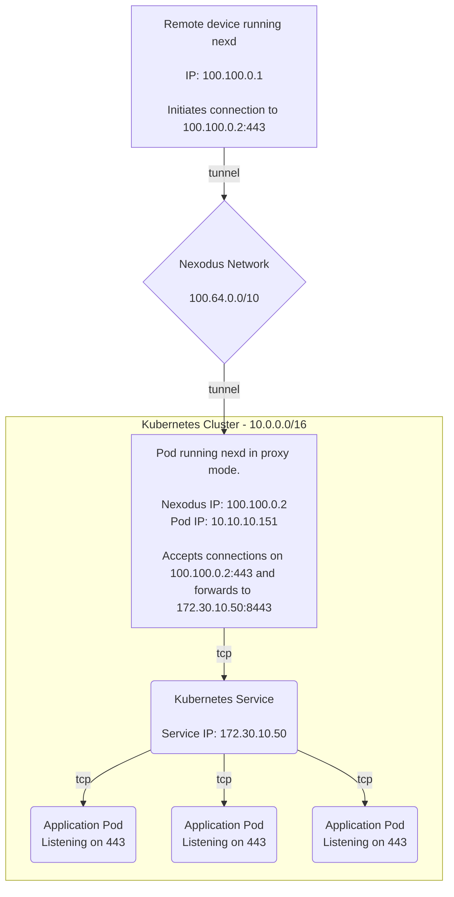
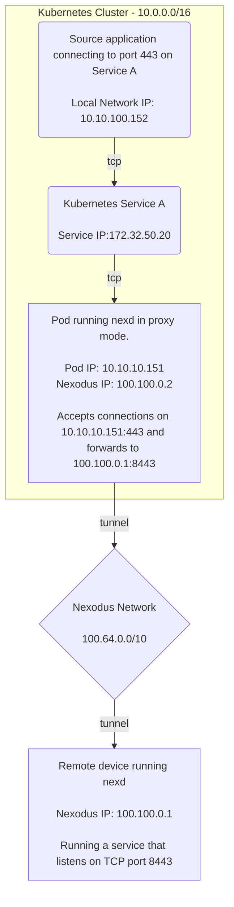
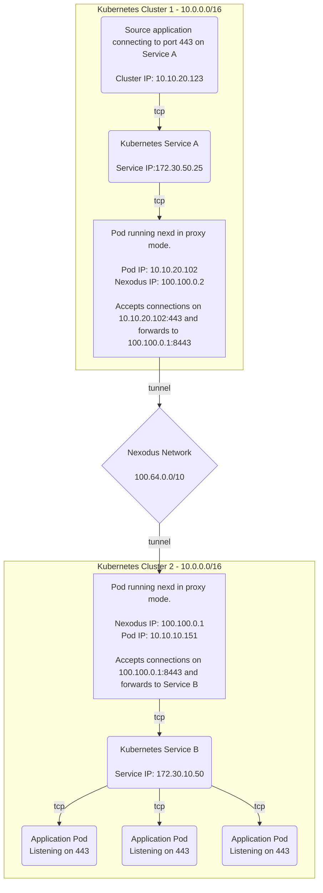
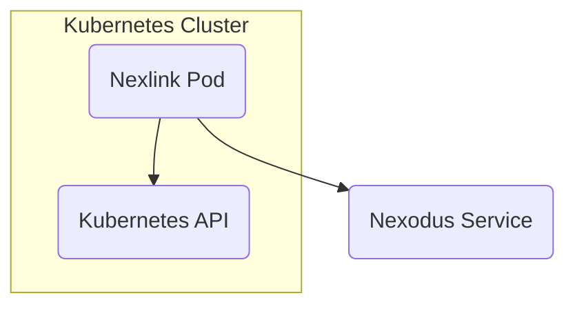

# Nexlink - Nexodus for Linking Kubernetes Services

> [Issue #706](https://github.com/nexodus-io/nexodus/issues/706)

## Summary

Develop a PoC to demonstrate how a higher-level networking abstraction can be built on top of Nexodus. Kubernetes will be used as the context for the PoC.

## Proposal

The default mode of running `nexd` requires privileges to create a network device. This prevents using it in a container environment without the ability to grant those extra privileges. [`nexd proxy`](userspace-mode.md) addresses this by allowing `nexd` to operate as an L4 proxy. However, the configuration of the L4 proxy is done in terms of port forwarding rules. For an application developer using Kubernetes, it is most convenient to define the desired network connectivity in terms of Kubernetes constructs. This proposal is to explore some approaches for using Nexodus to achieve connectivity to and from application resources in Kubernetes.

Before writing any new code, a few demos will be produced that demonstrate how connectivity with Nexodus works inside Kubernetes. By the end, we will produce some PoC code that automates the connectivity scenarios demonstrated in the demos.

### Demo 1 - Exposing a Kubernetes service over Nexodus

In this demo, we will provide a Kubernetes manifest that demonstrates how to run `nexd proxy` to forward connections to a Service inside of a cluster. This will allow any device within a Nexodus organization to reach this service, no matter where they are. For example, a developer's laptop could reach a service internal to a Kubernetes cluster running somewhere else, from a cloud provider to a corporate network.

In this example, the Pod running `nexd proxy` is using a single ingress proxy rule like this:

```sh
nexd proxy --ingress tcp:443:172.30.10.50:8443
```

The proxy rule could also refer to the Service by name instead of its IP address.

```sh
nexd proxy --ingress tcp:443:my-svc.my-namespace.svc.cluster.local:8443
```



### Demo 2 - Kubernetes Service to Reach a Resource Over Nexodus

This demo is similar to the first but in the reverse direction. It may be desirable for an application inside Kubernetes to reach a resource that is accessible within a Nexodus organization. An example here could be an application running in a public cloud that needs to reach a database running in a corporate data center.

In this example, the Pod running `nexd proxy` is using a single egress proxy rule like this:

```sh
nexd proxy --egress tcp:443:100.100.0.1:8443
```



### Demo 3 - Linking Kubernetes Services Across Clusters

This demo will show how to link two Kubernetes clusters together using Nexodus. This will allow an application in one cluster to reach a service in another cluster. This is similar to the previous demo, but the destination is a Kubernetes Service instead of a Nexodus device residing outside of a cluster.

In this example, we have one Pod running `nexd proxy` in each cluster. The Pod in cluster 1 is using a single egress proxy rule like this:

```sh
nexd proxy --egress tcp:443:100.100.0.1:8443
```

The Pod in cluster 2 is using a single ingress proxy rule like this:

```sh
nexd proxy --ingress tcp:8443:172.30.10.50:443
```

The ingress proxy rule could also refer to the Service by name instead of its IP address.

```sh
nexd proxy --ingress tcp:8443:my-svc.my-namespace.svc.cluster.local:443
```



### Nexlink - Automating the Configuration of Nexodus Proxy Rules

The previous sections describing three demo configurations to be produced show what connectivity scenarios are possible, but they all require manual setup. It should be possible to produce a new application that can automate the management of `nexd proxy` instances. Nexlink is a proposed PoC demonstrating an example of this automation.

#### High-Level Architecture

Nexlink will run as both a Kubernetes Controller and a client of the Nexodus API.

- **Kubernetes Controller** - The Controller will watch for changes to Services in the Kubernetes API and will create, update, and delete `nexd proxy` instances as needed to provide connectivity to those Services.

- **Nexodus API Client** - The Nexodus API client will be used to manage additional metadata on Nexodus Devices to reflect Services that have been exported and are reachable through that Device.



#### Nexlink Configuration

Nexlink will require the following configuration:

- **Nexodus API Endpoint** -- The Nexodus API endpoint to connect to. It will default to either the default development environment or one of the project's public environments, based on `NEXODUS_BUILD_PROFILE` at build-time. For a binary distributed by the project, this would be `https://try.nexodus.io`. If you build it yourself for testing, it will be `https://try.nexodus.127.0.0.1.nip.io`.
  
- **Nexodus API Credentials** -- Credentials to the API must be provided. User/password authentication is expected. When Nexodus supports API tokens, those will be supported as well.

- **Nexlink Realm** -- The Nexlink Realm is used to scope which Services it exports, as well as which Services it will import that are discovered via the Nexodus API. This will default to the name of the Kubernetes namespace.

!!! note Namespace Sameness vs Realm
    The alternative to the Realm configuration would be to require that namespaces are named the same across clusters and that all exported Services in namespace A get imported into namespace A on every other cluster running `nexlink` in that namespace. This would be simpler,
    but more restrictive.

Kubernetes API credentials are not required via configuration. Nexlink will use the default ServiceAccount for the namespace it is running in.

#### Exporting a Service

To export a Kubernetes Service, Nexlink must be running in the same Kubernetes namespace as the Service. The Service must have one or more Nexlink labels applied to it. The following labels are supported:

- **nexlink.nexodus.io/export** -- Set to `true` to export the Service. This label is required.

- **nexlink.nexodus.io/realm** -- Optional. The Nexlink Realm to export the Service to. This defaults to the name of the Kubernetes namespace.

- **nexlink.nexodus.io/name** -- Optional. The name of the exported Service. This defaults to the name of the Kubernetes Service. This name will be used as the Service name in other clusters when importing the Service.

Here is an example of a Service that will be exported to the `nexlink` Realm with the name `nginx`:

```yaml
apiVersion: v1
kind: Service
metadata:
  name: nginx-export
  labels:
    nexlink.nexodus.io/realm: "nexlink"
    nexlink.nexodus.io/name: "nginx"
    nexlink.nexodus.io/export: "true"
spec:
  ports:
  - name: http
    port: 80
    protocol: TCP
    targetPort: 80
  selector:
    app: nginx
```

The result of Nexlink seeing a service with these labels would be to spin up an instance of `nexd proxy` with a configuration similar to [Demo 1](#demo-1---exposing-a-kubernetes-service-over-nexodus).

For Nexlink in one or more other clusters to become aware of this exported Service, Nexlink will use the Nexodus API add the Nexlink Realm, exported Service name, and protocol+port information to the Nexodus Device associated with the `nexd proxy` instance providing connectivity to that service.

#### Nexodus API Changes Required

The previous section described the need to associate additional metadata to a Nexodus Device. This metadata will be used by Nexlink to discover Services that have been exported by a Nexodus Device. The Nexodus API will need to be extended to support this metadata.

It is our design goal that there is no Nexlink-specific functionality in Nexodus itself. Instead, this should help determine the changes necessary to support any such application built on top.

One option would be to add another column to Devices. Since this work is exploratory, instead we propose a new table for DeviceMetadata that has a device ID and a JSON blob. This JSON blob should be opaque to Nexodus and reserved for use by other API clients.

Today, updates to Devices get sent to all peers. By putting this data in a separate table, we will not create unnecessary churn between the API server and `nexd` instances.

Nexodus would make use of this JSON blob to store the following information:

```json
{
  "nexlink": {
    "realm": "nexlink",
    "services": [
      {
        "name": "nginx",
        "protocol": "tcp",
        "port": 80
      }
    ]
  }
```

#### Importing a Service

Nexlink will monitor the Nexodus API for devices in the same Nexodus organization that have exported services with a matching realm. When it finds such a device, it will create a `nexd proxy` instance and an associated Kubernetes Service to provide connectivity to those services. This configuration is similar to that of `nexd proxy` in [Demo 2](#demo-2---kubernetes-service-to-reach-a-resource-over-nexodus).

The end-to-end setup of an exported service in one cluster and the import of that service in another cluster matches the setup in [Demo 3](#demo-3---linking-kubernetes-services-across-clusters).

## Alternatives Considered

The Service export approach was chosen for simplicity for PoC purposes. It's expected that the right long-term way to do this is to adopt a common API that is used for this purpose.

### Multi-cluster Service (MCS) API

The [Multi-cluster Service (MCS) API](https://github.com/kubernetes-sigs/mcs-api) is a candidate API for the functionality described for Nexlink, assuming it gains traction as something to be more widely adopted.

### Gateway API

Adding Nexodus support for the Kubernetes [Gateway API](https://gateway-api.sigs.k8s.io/) is another integration point that should be explored. The Gateway API includes TCPRoute and UDPRoute resources that could be implemented as Nexodus proxy instances.
