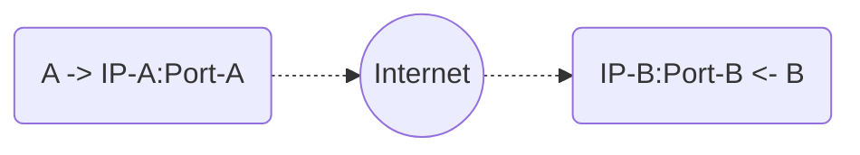
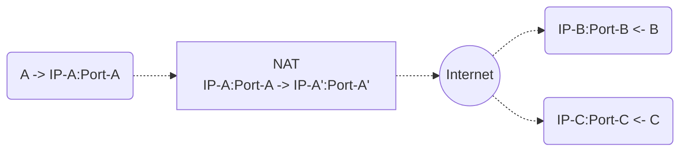
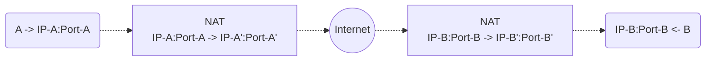
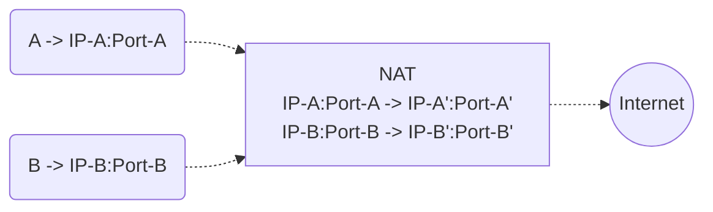
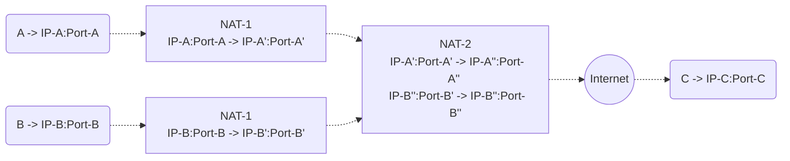
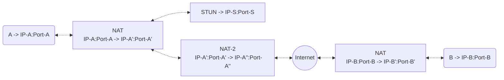
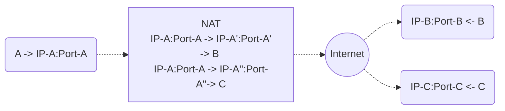
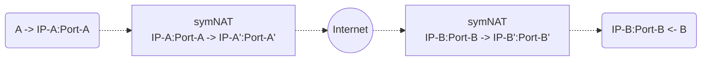
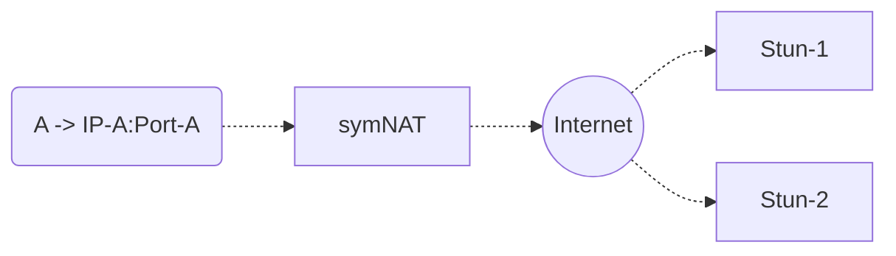
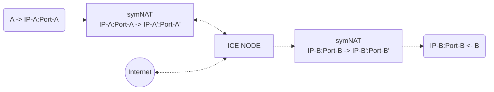

# Nexodus as a Connectivity Service

Nexodus provides L3 based connectivity between two endpoints. These endpoints can be present across various administrative domains behind different networking environments. Example of these networking environments range from a node that is directly reachable from internet through a public IP address to a node sitting behind a [symmetric NAT](https://datatracker.ietf.org/doc/html/rfc4787) and a firewall.

This document is an attempt to capture various connectivity scenarios that Nexodus currently supports and share high level details about the internals that enable these connectivity scenarios. Nexodus currently enables the networking connectivity between nodes using [wireguard](https://www.wireguard.com/).

## Architectural components

There are three main high level architectural components that play a role in establishing the Nexodus network connectivity.

**Nexodus ApiServer**: Nexodus control plane that provides various functionalities like Device Onboarding, Sharing device information among the devices etc.
**Nexodus Agent**: An agent that runs on each node. This agent does partial discovery for the node such as, determining if the device is behind symmetric NAT, discovering local endpoint, discovering server reflexive address (if it's behind a NAT device).
**ICE Node**: A node reachable on a public ip address. This node does two main functions

1) Assist with endpoint discovery
2) Relay traffic between two nodes if needed

## Connectivity Scenarios

### Nodes directly reachable through internet - Simplest Scenario

Both the nodes are reachable to each other through a public ip address. Following is the control flow to enable the connectivity between these two nodes,

* You need to install the Nexodus agent on these nodes and OnBoard the devices through Nexodus ApiServer.
* Before onboarding the device, agents discover the local endpoint and share this information with Nexodus ApiServer during onboarding.
* Agents periodically fetch the list of peers from the ApiServer
* Once both the nodes are onboard, agents running on each node will receive the information about the other node.
* Agent will create the wireguard interface, and set the peer configuration with the endpoint-ip set to the public ip shared by the peer during onboarding.
* E.g In above diagram, Node `A` agent will receive information about Node `B` from ApiServer and it will add peer configuration (setting endpoint-ip address to `IP-B`). Similarly Node `B` will add peer configuration for Node `A` with endpoint-ip set to `IP-A`.
* Wireguard will open a default port (51820) on both the nodes to receive the wireguard packets between both the nodes.

### Nodes behind asymmetric/easy NAT - Interesting Scenario

**Asymmetric NAT**: In simplest terms, NAT devices that support asymmetric NAT create destination independent mapping for the devices.

In the above diagram, Node `A` is trying to connect to Node `B`, NAT device assigns a port (`Port-A'`) for Node `A`, and overwrite outgoing packet's source ip to NAT device ip and source port `Port-A` to newly allocated `Port-A'`. Well, no surprises, that's usually how NAT (SNAT) works.
In an asymmetric NAT scenario, when Node `A` now tries to connect to Node `C`, it uses the same mapping `IP-A:Port-A -> IP-A':Port-A'`. So irrespective of how many devices Node `A` tries to connect beyond NAT, the mapping stays the same.

> **Note**
> If the `Port-A` changes, the NAT mapping might change.

Now back to the scenario.

In this scenario, both the nodes are behind the NAT, so they can't reach each other because they are not aware of the public ip address where they can send the outgoing packet. To discover this public ip address, the Nexodus agent running on the node uses [STUN request](https://www.ietf.org/rfc/rfc3489.txt). Nexodus agent sends a STUN request to an external stun server (*currently using google's stun server*) and the stun server responds back with the IP address/ Port it received the request from (Standard term is Reflexive Address). If the node is behind the asymmetric NAT, stun server will return the NAT device's IP address and the port that is allocated for the NAT mapping. Agent does this discovery before onboarding the device, and provides this information to the Nexodus ApiServer.

Respective Nexodus agents will fetch this information from the ApiServer, and add wireguard peer with endpoint-ip set to the respective reflexive address. For example, in the above scenario, Node `A` will get `IP-A':Port-A'` as a reflexive address from the stun server, and Node `B` will get `IP-B':Port-B'`. Node `A` will configure wireguard peer for Node `B` with endpoint-ip set to `IP-B':Port-B'`, similarly Node `B` will add peer for Node `A` with endpoint-ip set to Node `A` reflexive address `IP-A':Port-A'`. Given that reflexive addresses are reachable through the internet, wireguard will send packets to reflexive addresses, and that will bring packet to NAT device, and given that NAT device has mapping for that reflexive ip/port, it will forward the traffic internally.

> **Note**
> To enable this STUN based discovery of reflexive address (or public endpoint), you need to start Nexodus agent with `--stun` option. Otherwise it will only discover the local endpoint (node local's ip) and provide that to the ApiServer, and node will configure wireguard peer with it's local address as a endpoint-ip, and the connectivity will fail, because those endpoint-ip's are not visible beyond NAT.
> **Note**
> STUN based discovery helps in creating the NAT mapping, if the node doesn't have any mapping in the NAT device. This helps enable connectivity without any initial packet drops because of absence of NAT mapping.

#### Challenge 1 - what if the NAT mapping changes ?

NAT mapping can change for various reasons such as NAT device restart, or mapping expiration due to no incoming/outgoing traffic. Mapping expiration issues can be resolved by enabling the `persistent keepalive` for each wireguard peer. Wireguard keepalive sends packet periodically to its peer, and that prevents NAT mapping expiration. But it doesn't help with the other reasons that can cause NAT mapping changes. There is no mechanism provided by wireguard that an Nexodus agent can use to determine the connection state (TODO: Need to explore latest handshake option, if that can help), and use that to trigger the STUN based discovery to determine the new NAT mapping (reflexive address).

> **Note**
> Currently Nexodus agent does not configure wireguard keepalive for peers, but uses its own probe mechanism (sending ping to peers periodically) to determine the connection state. Currently it just does what wireguard keepalive is supposed to do.
> **ThinkingHatOn**
> do we want to extend it to help trigger the discovery for disconnected peers?

*So how are we solving this problem?*

Currently, we use a Discovery node to solve this problem. Discovery nodes can be any node that is reachable through a public ip address (or at the least, reachable on 51820 by all nodes looking to peer). Introducing the Discovery node adds an additional step in the provisioning flow. Given that each node runs the keepalive to all its peers, Discovery nodes will always have an updated reflexive address of its peer.

> **Note**
> Discovery nodes run the same Nexodus agent, but it runs with Discovery node configuration. To run Nexodus agent as a Discovery Node, you need to provide `--discovery-node --stun` option during onboarding of the node. Please refer to the [Deploying Nexodus Relay](../../deployment/nexodus-service.md#deploying-the-nexodus-relay) section for details about deploying a relay node.

The Discovery Node periodically fetches the wireguard peer configuration and sends the updated state (peer's endpoint-ip) to the Nexodus ApiServer. When the node's Nexodus agent fetches the new state from ApiServer, they update their peer configuration with the new endpoint ip to reconcile the broken connections between the peers. In order to maintain consitent peering and connectivity in a mobile and edge driven world, constant reconciliation is required to adjust to networks with middlebox and network state churn.

> **ThinkingHatOn**
> Assuming a Discovery node is in AWS cloud, I assume we have a similar risk of NAT mapping change? If yes, Elastic IP is probably a better option for Discovery nodes.

#### Challenge 2 - Multiple nodes behind same NAT

There are two possible scenarios where multiple nodes can be behind the same NAT.

1> Multiple nodes behind first level NAT, such as multiple home devices behind the home route.

In the above scenario, the reflexive address for Node `A` and Node `B` will be the same, except the port mapping (`IP-A' == IP-B' && Port-A' != Port-B'`). So if Node `A` and `B` joins the Nexodus Network, they both will add each other as a peer, with the same reflexive ip address. That will create a Hairpin situation because traffic from Node `A` will be forwarded to NAT device with the destination ip address of NAT device itself. Most NAT devices assume the destination IP address is beyond NAT somewhere in the internet, so in this scenario they will drop the packet, because it was not expecting **outgoing** packet to be destined to itself - until and unless NAT supports hairpinning.

Nexodus agent solves this challenge by checking devices with the same reflexive address, and if it finds the devices, it assumes that they are behind the same NAT. In this scenario, it uses their local ip address as an endpoint-ip in the wireguard peers configuration and establishes a direct tunnel between the nodes. This approach is a best effort, because even after using the local ip address as an endpoint-ip, wireguard connectivity can fail due to the restrictive configuration of the network connecting all these local devices.

> **ThinkingHatOn**
> I think we can leverage the Nexodus agent probing to mark the peers disconnected if they were directly connected but the ping probe failed?

2> Although there is another similar scenario where this solution won't work.

In the above scenario, both nodes `A` and `B` will have the same reflexive address (NAT-2 Ip address). Both the devices should be able to connect with node `C`, but they won't be able to communicate with each other, until and unless NAT-2 device supports hairpinning.

> **Warning**
> The direct peering approach mentioned in the above scenario possibly makes the situation worse in this case, because it will attempt to make direct peering in this scenario, given that the reflexive ip is the same. And direct peering will definitely fail because node `A` and `B` both are behind their first level NAT device, and there is no way to discover the ip address of the first level NAT devices.
> **ThinkingHatOn**
> We can improve the direct peering process for devices with the same reflexive ip, by using the probe again after setting up the direct peering. If the probe fails, we can either consider it as a symmetric NAT case or leave it with the existing reflexive addresses as endpoint-ip, assuming that the NAT-2 supports hairpinning.

#### Challenge 3 - STUN's location matters?

Above scenario is probably very close to the Carrier Grade NAT scenario. Discovery of reflexive addresses heavily relies on STUN server, and we assume that the reflexive address STUN see is the first NAT device in incoming packet, but if that's not the case, reflexive address might fail. Although we can rely on the ICE node to relay the traffic, detection of this scenario needs improvement in discovery. **TODO: Dig into ICE spec to see if there is any solution**

#### Nodes behind symmetric/hard NAT

**Symmetric NAT**: In simplest terms, NAT devices that support symmetric NAT create destination dependent mapping for the devices.

In the above diagram, Node `A` is trying to connect to Node `B`, NAT device assigns a port (`Port-A'`) for Node `A`, and overwrite outgoing packet's source ip to NAT device ip and source port `Port-A` to newly allocated `Port-A'`. When Node `A` tries to connect to Node `C`, it uses the different port mapping `IP-A:Port-A -> IP-A'':Port-A''`. So every new device Node `A` connects to, it's going to create new mapping. This 1:1 mapping is enforced on incoming traffic as well. Incoming traffic from the nodes that have NAT mapping is allowed (and the source port of the incoming traffic should match as well).

Due to the 1:1 ip:port level mapping between source and destination nodes, the reflexive address approach doesn't work here. Because if you use the reflexive address responded by STUN server, and set up the peer with that address as an peer's endpoint, symmetric NAT won't allow the incoming traffic because it's coming from a different ip address.

*How do Nexodus agent discover that it's host node is behind symmetric NAT?*

Nexodus agent sends STUN requests to two different stun servers. If both the stun servers respond with different reflexive addresses, that means the device is behind symmetric NAT.

There are two approaches to solve this scenario.

1> Using ICE node and its relay function to relay traffic between the nodes. This is the current approach that Nexodus supports.

Nexodus agent discovers that the node is behind the symmetric nat, and the peer listing that fetched from the ApiServer will have a relay node as a peer. Nexodus agent will add the ICE node as a wireguard peer. ICE node also receives the peer listing from ApiServer (because it's also a node in the network), and it can determine all the nodes that are behind the symmetric NAT (Nexodus agent pushes that information to API server during onboarding). It uses that peer information to set up nftables rules on the ICE node to enable the traffic forwarding between the symmetric NAT nodes.

2> Using ICE offer/answer mechanism to do direct hole punching.
