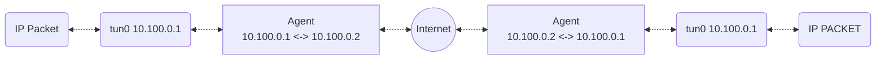
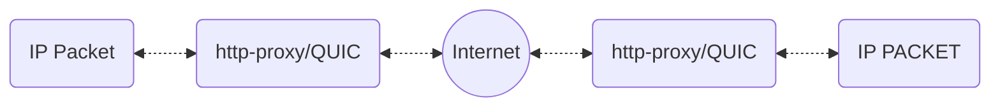

# QUIC based tunnel driver for Nexodus

> [Issue #1079](https://github.com/nexodus-io/nexodus/issues/1079)

## Summary

FIPS compliance is one of the major limitations of wireguard. This limitation can be a challenge for some users to adopt the wireguard based solution. QUIC protocol can be a viable alternative that can be used to build an alternate option that can support wireguard-like tunnelling and is FIPS compliant as well. QUIC is a new UDP based protocol that is designed to be secure and reliable. It is also designed to be FIPS compliant. This proposal is to create a QUIC based tunnel driver for Nexodus, that is feature compatible with the wireguard driver.

## Requirements

Before diving into the proposed solution, I think it is important to list out the requirements for the QUIC based tunnel driver. These requirements are pretty much derived from wireguard supported features.

- Tunnel creation across
  - public cloud
  - private cloud
  - on-prem (including devices behind home router)
- Support tunnel creation in above scenarios with
  - an easy NAT in place (UDP hole punching)
  - a symmetric NAT in place (through a relay server)
- It should support connection migration to support Edge use cases

The implicit non-functional requirements for the driver is to ensure that it doesn't require major overhaul of the architecture, because that's bad for user experience.

## Contextual overview of the QUIC protocol

QUIC was designed to address some of the major challenges with TCP such as head-of-line blocking, slow start, and congestion control. Underneath QUIC relies on UDP, so it is not affected by the TCP limitation. Initial QUIC protocol was designed with HTTP traffic in mind, so there were multiple extension proposed HTTP CONNECT/HTTP DATAGRAM methods to make HTTP work over QUIC. These new extensions are part of HTTP/3 and mostly rely on QUIC.

In general, whenever any client sends a HTTP request through any of the QUIC implementations, it goes through the following fall back mechanism.

- Attempt to send http request using QUIC over UDP, if it fails
- Attempt to send http request using http2 over TCP, if it fails
- Attempt to send http request using http1.1 over TCP

That way HTTP3/QUIC ensures that if the network in-between doesn't support QUIC/UDP, it can fallback to alternatives to provide a seamless experience to the end user. Most of the browsers currently implement the above fallback mechanism.

The next step of evolution of QUIC was to support unreliable packet transport over QUIC for supporting real time applications (e.g video/audio stream). That led to the creation of the QUIC DATAGRAM extension [RFC 9221](https://www.rfc-editor.org/rfc/rfc9221.html). QUIC DATAGRAM is a generic way to send any type of data over QUIC. It encapsulates the IP packet inside QUIC DATAGRAM and sends it over UDP. Receiver decapsulates the QUIC DATAGRAM and receives the packet. Further, to allow support for application for end to end unreliable packet transfer, HTTP DATAGRAM extension was proposed. Now applications can leverage HTTP DATAGRAM extension to send data unreliably over QUIC DATAGRAM. There were two HTTP CONNECT/DATAGRAM extensions were proposed

- connect-udp : To transport udp traffic over HTTP (Approved extension - [RFC 9298](https://www.rfc-editor.org/rfc/rfc9298.html))
- connect-ip : To transport ip traffic over HTTP (Recently approved, not yet published as RFC - [IETF Draft](https://datatracker.ietf.org/doc/draft-ietf-masque-connect-ip/))

These protocol extensions proposed a mechanism to use HTTP DATAGRAM to transport udp and IP packets over HTTP. If HTTP3 is supported, it would use QUIC DATAGRAM underneath, if HTTP3 is not supported, it would use HTTP2 DATAGRAM underneath. Point to note here is that underneath all the HTTP extensions are using QUIC DATAGRAM for unreliable transport for HTTP/3. We can leverage these extensions to build a tunneling solution that can support all the scenarios that wireguard supports.

## Proposal

The current proposal is to use QUIC DATAGRAM extension directly to transport the traffic. This extension is well supported in most of the stable implementation of the QUIC (e.g quic-go, quiche).Internet-layer tunneling protocols generally require a reliable and authenticated handshake followed by unreliable secure transmission of IP packets (You can tunnel over TCP, but it's slow!!). A single QUIC connection could support both parts with the use of QUIC DATAGRAM in addition to QUIC reliable streams. This would allow us to support the tunnel creation across public cloud, private cloud, on-prem (include devices behind home router) with an easy NAT in place (UDP hole punching) or a symmetric NAT in place (through a relay server). High level packet flow of the proposed solution would be as follows

- Agent creates a local interface and assigns ip address from the tunnel subnet.
  - It will use a similar mechanism to receive the ip address from the control plane, as the wireguard driver does.
- Agent creates QUIC connection to peer endpoint agent, with DATAGRAM enabled.
  - It can create separate connections for bidirectional traffic, but for easy NAT scenarios, it can use the same connection for both directions.
- Agent listen on the local interface and encapsulate the received IP packet in the QUIC DATAGRAM and send it to peer agent over QUIC connection
- Peer agent receives the QUIC DATAGRAM and decapsulate the packet and send it to the local interface

Establishing a QUIC connection across two nodes that's reachable through a public ip address is straight forward. But supporting the following scenarios needs some more work at agent level.

- QUIC connection across two nodes behind reflexive ip address (allowing all inbound/outbound traffic)
- QUIC connection across two nodes behind easy NAT and Symmetric NAT

QUIC protocol itself is unaware of the type of endpoint address (public ip, reflexive ip, easy NAT), so agents need to ensure that it provides all the details of the peer's ip addresses and port where it can establish the QUIC connection. We will need some of the similar solutions like we use for wireguard (stun base discovery) to support these scenarios.

## Future Considerations

We can implement all the connectivity scenarios that is supported by wireguard through QUIC DATAGRAM tunnel, but similar to wireguard, in case of symmetric NAT it needs to go through relay, or in worst case if gateway firewall disables the UDP protocol for inbound and outbound both, it won't be able to establish the tunnel. Recently approved HTTP DATAGRAM extension ("connect-ip") can be helpful in addressing these scenarios. This extension allows us to transport IP packets over HTTP. HTTP CONNECT will encapsulate packet in HTTP DATAGRAM and forward it to QUIC proxy, if HTTP3/QUIC DATAGRAM is available, it will tunnel traffic using QUIC DATAGRAM, if not, it will fallback to http/2 DATAGRAM. This way, even if UDP is blocked, it can still establish the tunnel through http.

This solution can also be extended to support the user space proxy use cases as well. Similar to `wireguard-go`, a QUIC aware HTTP proxy can be implemented to support the use space proxy use cases.

### Major challenges in implementing this approach

- HTTP DATAGRAM "connect-ip" extension is not yet supported by any of the QUIC protocol implementations, so that's a major challenge in implementing this approach.
- Once "connect-ip" support is available, we need http proxies to support this extension, or we can put effort into adding that support to the proxy of our choice.
  - Existing proxies that support QUIC are listed [here](https://github.com/quicwg/base-drafts/wiki/Implementations)
- Overall stability and performance of the implementation will be questionable at the early stage.

## References

[RFC 8999: Version-Independent Properties of QUIC](https://www.rfc-editor.org/rfc/rfc8999.html)

- This RFC defines the properties of QUIC that are independent of the QUIC version.

[RFC 9000: QUIC: A UDP-Based Multiplexed and Secure Transport](https://www.rfc-editor.org/rfc/rfc9000.html)

- This RFC defines the QUIC transport protocol.

[RFC 9001: Using TLS to Secure QUIC](https://www.rfc-editor.org/rfc/rfc9001.html)

- This RFC defines the use of TLS to secure QUIC.

[RFC 9002: QUIC Loss Detection and Congestion Control](https://www.rfc-editor.org/rfc/rfc9002.html)

- This RFC defines the loss detection and congestion control mechanisms for QUIC.

[RFC 9114: HTTP/3](https://www.rfc-editor.org/rfc/rfc9114.html)

- This RFC defines semantics of HTTP/3 based on the features supported by QUIC protocol and how those HTTP/3 semantics are mapped over QUIC.

[RFC 9220: Bootstrapping WebSockets with HTTP/3](https://www.rfc-editor.org/rfc/rfc9220.html)

- This RFC was the first use case that motivated the need of having unreliable transport support in the QUIC.
  
[RFC 9221: An Unreliable Datagram Extension to QUIC](https://www.rfc-editor.org/rfc/rfc9221.html)

- RFC 9220 led to this RFC, which defines the unreliable datagram extension to QUIC Transport protocol.

[RFC 9297: HTTP Datagrams and the Capsule Protocol](https://www.rfc-editor.org/rfc/rfc9297.html)

- Given that your have QUIC DATAGRAM now, this RFC defines how HTTP DATAGRAM can be used to transport IP packets over HTTP through QUIC DATAGRAM

[RFC 9298: Proxying UDP in HTTP](https://www.rfc-editor.org/rfc/rfc9298.html)

- Well if you can transport TCP over HTTP through QUIC DATAGRAM, why not UDP? This RFC defines how UDP can be transported over HTTP through QUIC DATAGRAM.

[Proxying IP in HTTP](https://datatracker.ietf.org/doc/draft-ietf-masque-connect-ip/)

- If UDP is possible, let's expand it and transport IP packets over HTTP through QUIC DATAGRAM. This draft defines how IP packets can be transported over HTTP through QUIC DATAGRAM. This draft is approved, and sooner will be published as RFC.

[Multiplexed Application Substrate over QUIC Encryption (masque)](https://datatracker.ietf.org/wg/masque/about/)

- Most of the work related to transporting packets unreliably over QUIC DATAGRAM is happening in this working group.

[Requirements for a MASQUE Protocol to Proxy IP Traffic](https://www.ietf.org/archive/id/draft-ietf-masque-ip-proxy-reqs-03.html)

- This draft lists some motivation about why we need to transport IP packets over HTTP through QUIC DATAGRAM. Good set of use cases defined in this draft and the use case of Nexodus is one of them.
  
[draft-pauly-masque-quic-proxy](https://www.potaroo.net/ietf/idref/draft-pauly-masque-quic-proxy/)

- This was the initial draft that proposed a solution for proxying UDP over HTTP, and it eventually merged in RFC 9298.

[Existing QUIC Implementations](https://github.com/quicwg/base-drafts/wiki/Implementations)

- List of existing QUIC implementations, that includes implementation of QUIC protocol, proxies that support QUIC protocol and more.

[The MASQUE Protocol](https://www.ietf.org/archive/id/draft-schinazi-masque-02.html#name-ip-proxying)

- Draft that was used to brainstorm the proxy related use cases.

[IP Tunnels in the Internet Architecture](https://datatracker.ietf.org/doc/html/draft-ietf-intarea-tunnels-13)

- No direct relevance to the proposal, but a good read about IP tunnel architecture.

[Bootstrapping WebSockets with HTTP/2 RFC 8441](https://datatracker.ietf.org/doc/rfc8441/)

- QUIC DATAGRAM was a result of porting this RFC to HTTP/3.
