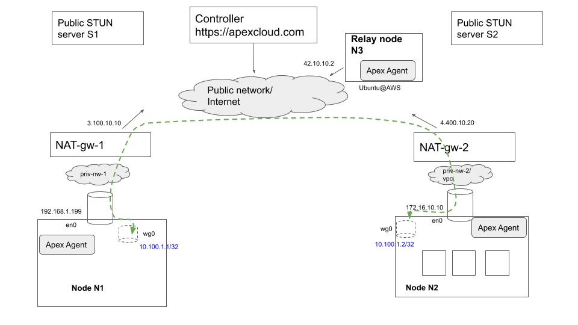

# High-Level Solution Architecture

The following figure illustrates briefly how the overall solution works. .

The figure illustrates two edge nodes N1 and N2 that are each running in their own respective private networks in which private IP addressing is used (based on RC 1918 for instance), and hence these nodes/ devices are not directly addressable from outside their own private networks.  Access to the public internet is via NAT gateways in each private network that perform SNAT (Source Network Address Translation), translating the private source IP address and source TCP and UDP ports of packets originated by devices inside the private network when sending traffic to external destinations on the public network or Internet. In the example shown, NAT-gw-1 performs SNAT and swaps in its public-facing IP address (3.100.10.10) and an available TCP/ UDP port on this IP address for traffic originating within the private network and destined for the public Internet.

A brief summary of Nexodus' operation in this environment is as follows. Nodes N1 and N2 are running the Nexodus agent and register themselves with the Nexodus Service running at a public Internet endpoint <https://nexodus.example.com>. In this particular scenario, there is also a relay node (interchangeably also referred to as a "hub router" in the Nexodus documentation), which is any Linux Virtual machine running in the same Nexodus organization as nodes N1 and N2 and directly reachable on the public internet.

The agents determine their own respective public IP addresses and port via one of two techniques. (1) They initiate a query using the STUN protocol (Session Traversal Utilities for NAT) towards 1 or more well-known public STUN servers run by providers such as Google. These servers provide a free service that returns a STUN response containing in its inband payload, the SNAT'ed public IP and source port information it sees for the STUN request, thereby enabling the Nexodus agents in this case to determine their own public (IP address, port). (2)  They can connect to the Nexodus Service which in turn can reflect their public (IP address, port) seen by the service and the relay node to all Nexodus nodes in the organization, thereby enabling every node to determine the public reachability information of every other node within the Nexodus organization (subject to any additional administered policies that may filter distribution of reachability information within a organization).  The Nexodus agents can then attempt to initiate Wireguard tunnel sessions with each other's public IP information. In most common cases, this attempt should succeed since the NAT gateways at each location have already opened up these public-facing ports for the outbound connections initiated previously by the Nexodus agents when connecting to the Nexodus Service and relay nodes. In the case where the NAT gateways execute a stricter form of Source NATting known as Symmetric NAT, it may not be possible for Nexodus nodes to initiate wireguard tunnels directly with each other, in which case they have logic to revert to sending traffic to the relay node and having it perform an IP routing operation towards the target Nexodus node. As far as end-user application traffic on each node is concerned, it is routed to use the Wireguard virtual interface and get encrypted and tunneled towards the desired destination wireguard interface IP by the wireguard interface driver logic.

This was a brief summary of the overall architecture and operation of the Nexodus solution. There are additional details related to how end devices register with the service and secure cryptographic identification of endpoints using X.509 certificates which are not covered here for the sake of brevity. Also note that at the time of writing, the Nexodus architecture is still evolving and some concepts described here may change eventually. For instance, in the current design, the use of the relay node is optional within a Nexodus organization and STUN servers are queried to determine public IP mapping information. A future version of this design may be altered to mandate the use of the relay nodes and also use these for public IP information discovery without depending on public STUN servers. The purpose of this summary is to illustrate the core concepts while recognizing that some of the details may change as the architecture evolves.  
