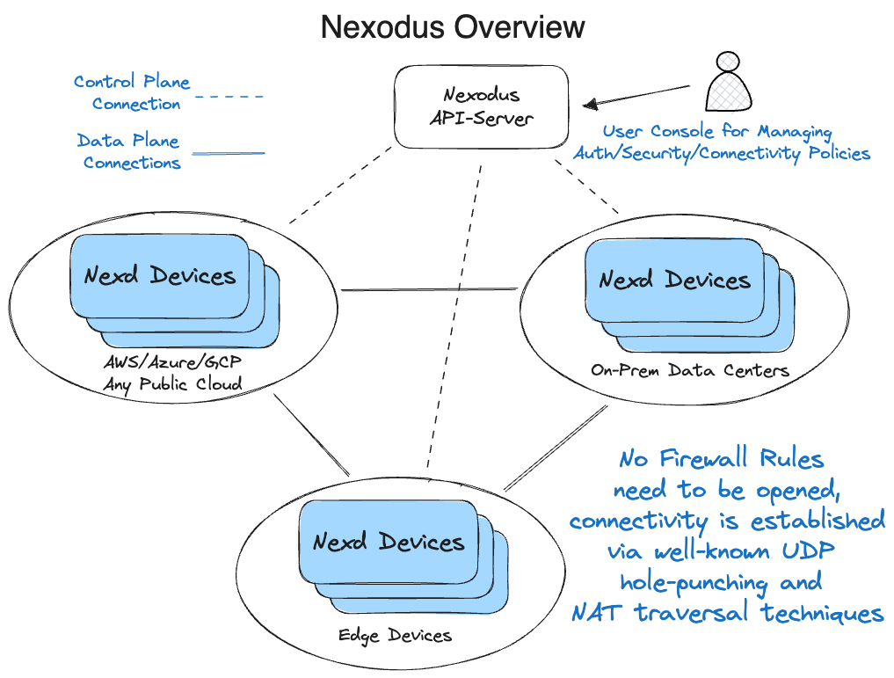

# Quick Start

This guide will walk you through getting your first devices connected via Nexodus.



## Install and Start the Nexodus Agent

### Fedora, CentOS Stream

Supported versions:

- Fedora 38 (x86_64, aarch64)
- CentOS Stream 9 (x86_64, aarch64)

```sh
# Enable the COPR repository and install the nexodus package
sudo dnf copr enable russellb/nexodus
sudo dnf install nexodus

# Start the nexodus service and set it to automatically start on boot
sudo systemctl start nexodus
sudo systemctl enable nexodus
```

Edit `/etc/sysconfig/nexodus` if you plan to use a Nexodus service other than <https://try.nexodus.io>.

Query the status of `nexd` and follow the instructions to register your device.

```sh
sudo nexctl nexd status
```

### Brew

For Mac, you can install the Nexodus Agent via [Homebrew](https://brew.sh/).

```sh
brew tap nexodus-io/nexodus
brew install nexodus
```

To start the `nexd` agent and also have it start automatically on boot, run:

```sh
sudo brew services start nexodus
```

Query the status of `nexd` and follow the instructions to register your device.

```sh
sudo nexctl nexd status
```

### Windows

There are various ways for Windows to start processes and services with Powershell and an eventual nexodus agent GUI, but for testing Nexodus on a Windows device, the following is a simple method.

- For Windows, you will need to install Wireguard from the official [Windows Wireguard](https://www.wireguard.com/install/) installer.
- Download the [Windows x86-64](https://nexodus-io.s3.amazonaws.com/qa/nexodus-windows-amd64.zip) zip file containing the `nexd.exe` and `nexctl.exe` executables. For simplicity, move those two files to `C:\` (or into a directory in your $PATH).
- In the start menu, type `cmd` and right-click on `Command Prompt` and `Run as Administrator`. Then, run the following in the command line and follow the URL to authenticate.

```terminal
C:\Users\Administrator> cd C:\
C:\> nexd.exe
Your device must be registered with Nexodus.
Your one-time code is: LYNW-HKGO
Please open the following URL in your browser to sign in:
https://auth.try.nexodus.io/realms/nexodus/device?user_code=LYNW-HKGO
```

- You will now have an IP address on an interface named `wg0` and be peered with other Nexodus devices in the organization, which can be viewed by running `nexctl nexd peers list` in another window.

### Docker or Podman

For testing purposes, you can run the Nexodus Agent in a container. The following command will start a container and launch a shell inside it.

```sh
docker run --rm -it --cap-add SYS_MODULE --cap-add NET_ADMIN --cap-add NET_RAW \
    --sysctl net.ipv6.conf.all.disable_ipv6=0 quay.io/nexodus/nexd
```

Once the container is running, start `nexd` and follow the instructions to register your device.

```sh
nexd --service-url https://try.nexodus.io
```

### Other

Download the latest release package for your OS and architecture. Each release includes a `nexd` binary and a `nexctl` binary.

- [Linux x86-64](https://nexodus-io.s3.amazonaws.com/qa/nexodus-linux-amd64.tar.gz)
- [Linux arm64](https://nexodus-io.s3.amazonaws.com/qa/nexodus-linux-arm64.tar.gz)
- [Linux arm](https://nexodus-io.s3.amazonaws.com/qa/nexodus-linux-arm.tar.gz)
- [Mac x86-64](https://nexodus-io.s3.amazonaws.com/qa/nexodus-darwin-amd64.tar.gz)
- [Mac arm64 (M1, M2)](https://nexodus-io.s3.amazonaws.com/qa/nexodus-darwin-arm64.tar.gz)
- [Windows x86-64](https://nexodus-io.s3.amazonaws.com/qa/nexodus-windows-amd64.zip)

Extract and install the binaries. For example, on Linux x86-64:

```sh
tar -xzf nexodus-linux-amd64.tar.gz
cd nexodus-linux-amd64
sudo install -m 755 nexd nexctl /usr/local/bin
```

Start `nexd` with `sudo` and follow the instructions to register your device.

```sh
sudo nexd --service-url https://try.nexodus.io
```

## Test Connectivity

Once you have the agent installed and running, you can test connectivity between your devices. To determine the IP address assigned to each device, you can check the service web interface at <https://try.nexodus.io>, look the `nexd` logs, or get the IP using `nexctl`.

```sh
sudo nexctl nexd get tunnelip
sudo nexctl nexd get tunnelip --ipv6
```

Try `ping` or whatever other connectivity test you prefer.

```sh
ping 100.100.0.1
```

Alternatively, you can verify connectivity to the device's peers with the following.

```shell
sudo nexctl nexd peers ping
```
