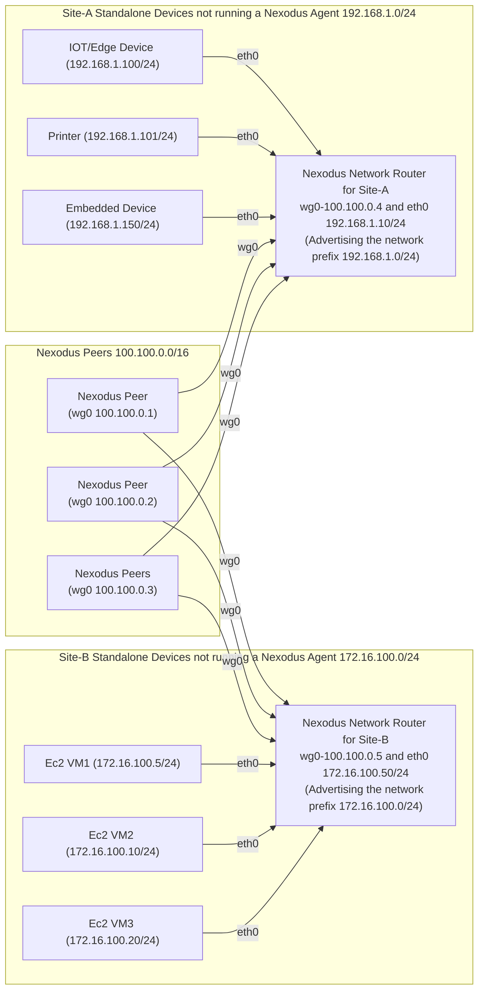

# Network Routers

There may be scenarios where you do not want to run a Nexodus agent on every host that you intend to have connectivity to a Nexodus Organization. It is possible to have a host act as a Network Router to provide connectivity between a Nexodus network and a subnet a Nexodus agent node can access.

## Connect any nodes on your network or connect sites

Any Linux Nexodus device running Nexodus can be a network router. The forwarding and NAT are performed with netlink and netfilter.

The situations where this can be useful are wide-ranging. They can span from connecting a remote cluster, an air-gapped EC2 VPC, or connecting any number of remote sites that you may not want to or cannot run an agent. SD-WAN solutions can be expensive and overly complex. This can be a lightweight alternative.

- Site-A Configuration: You simply specify the network prefix you want to advertise and Nexodus will use the physical interface that contains the default route to connect to the non-Nexodus nodes.

```terminal
nexd router --child-prefix 192.168.1.0/24 --network-router --service-url https://try.nexodus.io
```

- Site-B Configuration: The only difference is specifying the network CIDR for site-B.

```terminal
nexd router --child-prefix 172.16.100.0/24 --network-router --service-url https://try.nexodus.io
```



> **Note**
> Nexodus accepts as many networks as you want to specify in the `--child-prefix=192.168.1.0/24 --child-prefix 192.168.100.0/24 --child-prefix 172.16.100.0/24 ...` configuration. This means you can advertise as many subnets as you want from the Nexodus device running as a network router.

By default, Nexodus network routers perform NAT, specifically, source NAT for devices coming from a Nexodus mesh with a destination of one of the devices not running the Nexodus agent. This enables connectivity to those devices without any configuration on the devices.

You have the option to disable NAT with `--disable-nat` which will cause the remote non-Nexodus devices to receive traffic from the Nexodus agent devices without any address translations. This mode requires routes to be added (or redistributed in your network IGP) for hosts in `192.168.1.0/24` to reach Nexodus nodes `100.100.0.0/16` via the `Nexodus Network Router` eth0 ip of `192.168.1.10`.

The subnet exposed to the Nexodus organization may be a physical network the host is connected to, but it can also be a network local to the host. This works well for exposing a local subnet used for containers running on that host. A demo of this use case for containers can be found in [scenarios/containers-on-nodes.md](scenarios/containers-on-nodes.md).

_Additional details and diagrams are located in the network router design documentation_ [docs/development/design/network-router](https://github.com/nexodus-io/nexodus/blob/main/docs/development/design/network-router.md)
