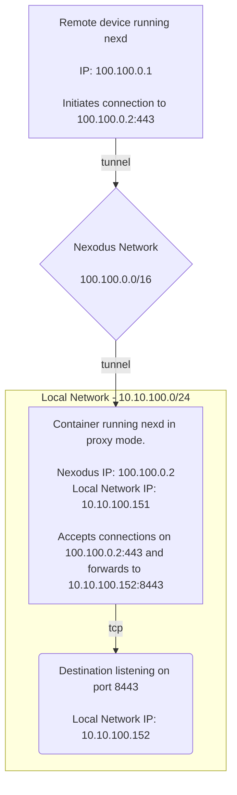
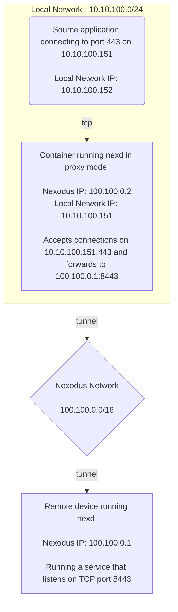
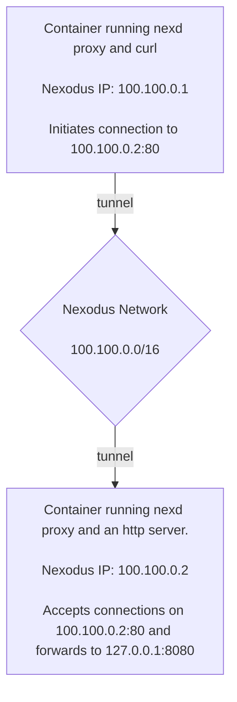

# Proxy Mode for `nexd`

The normal mode of operation for `nexd` is to create a tunneled network interface on the device with an IP address within a Nexodus organization. Creating this network interface requires elevated privileges, so it is not usable in all environments.

Containers are a common example of an environment where `nexd` cannot be run in its normal mode. In these cases, `nexd` can be run in `proxy` mode. In proxy mode, `nexd` will not create a tunneled network interface, but will instead operate as a layer 4 proxy.

## Proxy Rules

Proxy rules must be specified as command line flags to `nexd` after specifying the `proxy` subcommand.

!!! warning "Beware of placement of flags to `nexd`"

    `nexd` has both general flags and subcommand-specific flags. When running `nexd` in proxy mode, the subcommand-specific flags must be specified after the subcommand. For example, here is an example of providing a general flag, as well as a `proxy` subcommand-specific flag:

    ```console
    nexd --request-ip 100.100.0.50 proxy --ingress $INGRESS_PROXY_RULE
    ```

### Ingress Proxy

Ingress proxy rules are specified with the `--ingress` flag. This flag can be specified multiple times to specify multiple ingress proxy rules. This is the format for an ingress proxy rule:

```console
--ingress protocol:port:destination_ip:destination_port
```

* `protocol` - may be `tcp` or `udp`
* `port` - the port on the host that the proxy will listen on for connections made from a network able to access this device.
* `destination_ip` - the IP address of the destination within a Nexodus organization that the proxy will forward traffic to.
* `destination_port` - the port on the destination within a Nexodus organization that the proxy will forward traffic to.

Here is an example showing an ingress proxy rule:

```console
nexd proxy --ingress tcp:443:10.10.100.152:8443
```



### Egress Proxy

Egress proxy rules are specified with the `--egress` flag. This flag can be specified multiple times to specify multiple egress proxy rules. This is the format for an egress proxy rule:

```console
--egress protocol:port:destination:destination_port
```

* `protocol` - may be `tcp` or `udp`
* `port` - the port that `nexd` will accept connections to made to its IP address within the Nexodus organization this device is a member of.
* `destination` - the IP address or hostname of the destination on a network accessible to the device that the proxy will forward traffic to.
* `destination_port` - the port on the destination on a network accessible to the device that the proxy will forward traffic to.

Here is an example showing an egress proxy rule:

```console
nexd proxy --egress tcp:443:100.100.0.1:8443
```



### UDP Proxy Behavior

Since UDP is a connectionless protocol, `nexd proxy` must maintain its own state for each UDP flow to ensure that return traffic is forwarded appropriately. These flows time out after 60 seconds of inactivity.

## Demo Using Containers

This section provides instructions on running an end-to-end demonstration of using `nexd proxy` on both ends of a connection. We will run two containers: one running an http server, and another that would like to reach that http server. `nexd` in each container will negotiate an encrypted tunnel directly between each other. The connection will go over this tunnel.



### Container with a proxy and an HTTP server

 First, start a container to act as the http server.

```console
docker run -it --rm --name nexd-proxy-demo-server quay.io/nexodus/nexd
```

From within the container, start an http server and then start `nexd proxy`. Follow the authentication instructions in the output.

!!! note

     Once the device has authenticated with the Nexodus control plane, watch the output to see what IP has been assigned to this proxy. The rest of this demo assumes it was `100.100.0.1`.

```console
echo "It works!" > index.html
python3 -m http.server 8080 &

./nexd proxy --ingress tcp:80:127.0.0.1:8080 https://try.nexodus.io
```

### Container with a proxy and an HTTP client

Next we need a second container that will act as the http client that will connect to a locally running `nexd proxy` to reach its destination. Start the container:

```console
docker run -it --rm --name nexd-proxy-demo-client quay.io/nexodus/nexd
```

From within the second container, start `nexd proxy` in the background, and follow the authentication instructions in the output from `nexd`.

```console
REMOTE_NEXD_IP=100.100.0.1
./nexd proxy --egress tcp:80:${REMOTE_NEXD_IP}:80 https://try.nexodus.io &
```

Once the device has succcessfully connected and authenticated with Nexodus, you should be able to reach the http server from the first container over a Nexodus managed tunnel.

```console
$ curl http://localhost
It works!
```