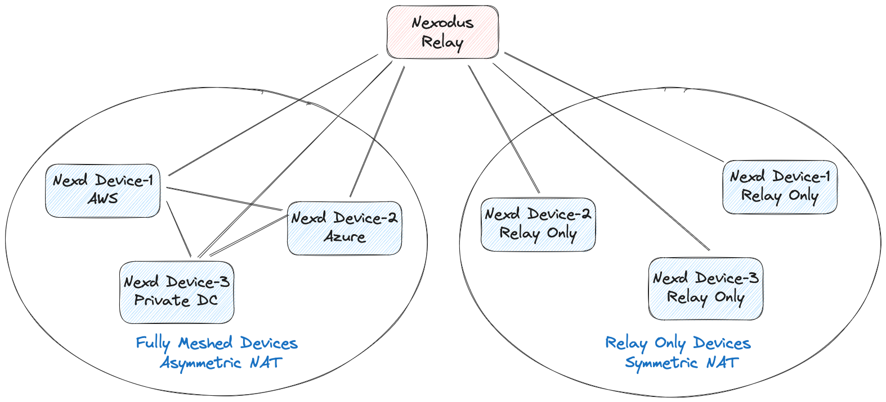

# Deploying Nexodus Relay Nodes

The Nexodus Service makes the best effort to establish direct peering between devices, but in some scenarios such as symmetric NAT, it's not possible to establish direct peering. To establish connectivity in those scenarios, the Nexodus Service uses a relay node to relay the traffic between the endpoints.

Currently Nexodus supports two types of relay:

1. Wireguard based relay :
    This relay node does not offer public, shared relay nodes. Instead, a relay node must be added to each VPC which requires them. Adding a relay node follows the same process as any other device but with additional options given to `nexd`. This relays traffic using the wireguard tunnels, so the traffic gets decrypted and re-encrypted at the relay node. This relay node is hosted by a member of the organization and can be any device that can run the Nexodus Agent.
2. HTTPS based relay (DERP Relay) :
    This relay node is a public, shared relay node that is hosted by Nexodus at [Nexodus DERP Relay](relay.nexodus.io). This relay node relays traffic using HTTPS/TLS, so the traffic is not decrypted at the relay node. This relay node is hosted by Nexodus and is available to all users. Scenarios where user don't want to use the public relay, user can manually deploy this relay on their own infrastructure and onboard the relay similar to the wireguard relay node, but as a wireguard relay, it would be scoped to the specific VPC where it's on-boarded.

Given that both the relays can be on-boarded manually and relays the traffic, the reason we support wireguard based relay is because it performs relatively better compared to HTTPS/TLS relay.

A relay node needs to be reachable from all the devices to ensure that devices can successfully connect (wireguard/udp, https/tcp) to the relay (and also on a predictable Wireguard port such as the default UDP port of 51820 for wireguard based relay). They would most commonly be run on a public IP address, though it could be anywhere reachable by all devices in the VPC. There is only a need for one relay node in a VPC.

Given that Nexodus provides multiple options on how user can relay the traffic and they can switch between them, Nexodus uses a simple approach to select the relay node:

1. If there is no on-boarded relay present in the VPC, Nexodus will use the public DERP relay.
2. If user on-boards a relay node (wireguard or DERP), It will switch to use the on-boarded relay.
3. If user removes the on-boarded relay node, It fallback to the public DERP relay node.

NOTE: Currently Nexodus does not support multiple relay nodes in a VPC.



Please follow the instructions below on how to setup specific relay.

## Setup Nexodus Wireguard Relay

Unlike normal peering, the Nexodus relay node needs to be reachable from all the nodes that want to peer with the relay node. The default port in the following command is `51820` but a custom port can be specified using the `--listen-port` flag. Follow the instructions in [Deploying the Nexodus Agent](agent.md) instructions to set up the `nexd` binary.

To make the device a relay node, add the `relay` subcommand to the `nexd` command.

```sh
sudo nexd --service-url https://try.nexodus.127.0.0.1.nip.io relay
```

If you're using the Nexodus rpm package, edit `/etc/sysconfig/nexodus` to add the `relay` subcommand. If you're using the Nexodus deb package, edit `/etc/default/nexodus` to add the `relay` subcommand.

```sh
NEXD_ARGS="--service-url https://try.nexodus.io relay"
```

## Setup Self Hosted Nexodus DERP Relay

If user would prefer to use it's own relay instead of the public DERP relay, user can deploy the relay node on their own infrastructure and on-board it to Nexodus. Peers behind symmetric NAT will switch to the self hosted relay once it's successfully on-boarded. DERP relay uses TLS for communication, so user will need to provide a TLS certificate and key to the relay node. User can onboard the relay in following two ways:

### Using public DNS name

User need to configure a DNS name (e.g NameCheap, CloudFlare etc) resolving to the IP address of the machine running the relay node. The DNS name will be used to generate the TLS certificate (letsencrypt) for the relay node. User can use the following command to onboard the relay node:

```sh
sudo nexd relayderp --hostname <relay domain name> --onboard
```

### Using private DNS name

If user don't want to use a public DNS name, user can use a private DNS name (e.g. `xyz.relay.io`) to onboard the relay. But this requires users to generate a TLS certificate and key for the relay node. User can use the following commands to generate the TLS certificate and key (you need openssl to generate the key and certificate):

```sh
# Create CA’s root key
openssl genrsa -out rootCA.key 2048

# Create CA’s root certificate, that will be used to sign the server certificate
openssl req -x509 -new -nodes -key rootCA.key -sha256 -days 1024 -out rootCA.pem

# Create server key and certificate sign request
openssl req -new -newkey rsa:2048 -sha256 -nodes -keyout server.key -out server.csr
```

Create an extension file

```sh
# cat v3.ext
authorityKeyIdentifier=keyid,issuer
basicConstraints=CA:FALSE
keyUsage = digitalSignature, nonRepudiation, keyEncipherment, dataEncipherment
subjectAltName = <relay-private-domain-name>
```

Set subjectAltName to the private DNS name (e.g. `xyz.relay.io`) that user want to use for the relay node.

Run the following command to sign and generate the server certificate

```sh
# Sign and create server certificate , do not use more than 825 days for certificate, otherwise Darwin OS will throw error
openssl x509 -req -in server.csr -CA rootCA.pem -CAkey rootCA.key -CAcreateserial -out server.crt -days 800 -sha256 -extfile v3.ext
```

Above command will generate rootCA key (rootCA.key) and certificate (rootCA.cet) files and server key (server.key) and certificate (server.crt) files. Rename the server key and certificate files to `<relay-private-domain-name>.key` and `<relay-private-domain-name>.crt` respectively.

```sh
cp server.key xyz.relay.io.key
cp server.crt xyz.relay.io.crt
```

Now you can use the private DNS name and the key/certificates to onboard the relay. Use the following command to onboard the relay node:

```sh
sudo nexd relayderp --hostname xyz.relay.io -a ":443" --certmode manual --certdir "<certificate-directory-path>"  --onboard
```

In this scenario user need to install the root CA key (rootCA.key) to all the nodes that needs to be connected through this onboard relay. Copy the file to each node and run the following command to install the root CA key:

```sh
CAROOT=</path/to/cert/dir> mkcert -install
```

Now you can onboard the device to Nexodus and if the device is behind symmetric NAT, it will use the self hosted relay and will use the root CA key to verify the TLS certificate of the relay node.