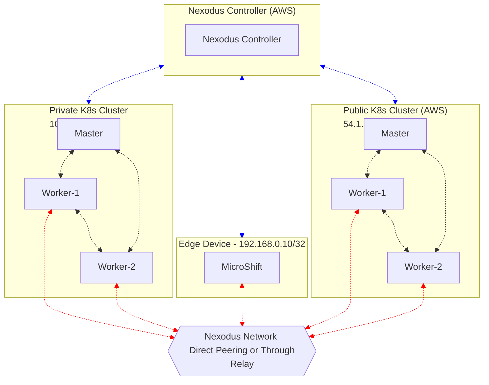

# Connecting Edge Device to the Kubernetes Service

This document takes you through the instructions to setup a topology to demonstrate a scenario where a Pod running on MicroShift on an Edge device can access the
*.* Service running on a Kubernetes cluster deployed in private data center
*.* Service running on a Kubernetes cluster deployed in the Cloud

## Deployment Topology

You need to set up the following minimum deployment topology.

* Deploy MicroShift on a VM that is running behind the NAT and not externally reachable.
* One Master and 2 Worker node Kubernetes Cluster on a Private data center, that is not reachable from MicroShift VM
* One Master and 2 Worker node Kubernetes Cluster on a Public Cloud (e.g AWS)

Note: Please see the troubleshooting section for some additional information around possible issues and their workarounds (specifically around MicroShift deployment)

## Deploying Nexodus Controller

Please follow the instructions provided in the [README](../README.md#deploying-the-nexodus-controller) to set up the Nexodus Controller. Make sure you setup the
controller on the machine that is reachable from your Kubernetes and MicroShift clusters.

Once your Nexodus controller is set up, please get the CA certification from Nexodus's secret and keep it handy. You will need this CA cert for deploying the Nexodus agent and to access the Nexodus Controller UI.

```sh
kubectl get secret -n nexodus nexodus-ca-key-pair -o json | jq -r '.data."ca.crt"'
```

## Deploying the Nexodus Relay Node

Please follow the instructions provided in the [README Nexodus Relay Section](../README.md#deploying-the-nexodus-relay) to setup a relay node, create a relay enabled zone, move the user to newly created zone and OnBoarding the Relay Node. Once the Relay node is OnBoarded successfully, its time to OnBoard all the nodes that want to be part of the Nexodus Network.

## Deploying Nexodus Agent on Clusters Nodes

Please follow the [README Section](../README.md#deploying-on-kubernetes-managed-node) to deploy the Nexodus agent. It mainly requires two steps

1. Set config data in `./deploy/nexodus-client/overlays/dev/kustomization.yaml` and deploy the Nexodus agent's manifest files

   ```sh
        kubectl apply -k ./deploy/nexodus-client/overlays/dev
    ```

2. Tag the worker nodes that you want to join the Nexodus network.

    ```sh
        kubectl label nodes <NODE_NAME> app.kubernetes.io/nexodus=
    ```

    This will deploy the Nexodus agent pod on that node and onboard the node to the Nexodus network.

If you tag all the worker nodes in both private and public kubernetes cluster and also the MicroShift node, the deployment topology will look as shown in the below diagram.



Red arrows show the nodes connected to each other through the Nexodus network. The connectivity between the nodes can be a direct peering or through a relay (in case of symmetric NAT).

## Deploy NodePort Service On Kubernetes Clusters

Deploy NodePort service such as Nginx or any Client Server service to both private and public kubernetes clusters. You can deploy following example nginx service for testing

```sh
kubectl apply -f https://raw.githubusercontent.com/packetdrop/ndb/main/deployment/nginx-node-port.yaml
```

It deploys two replicas of the deployment across the worker nodes.

## Access NodePort service from MicroShift

Deploy a curl pod in MicroShift and you can access the service using the wireguard ip addresses assigned to the connected nodes.

```sh
kubectl run mycurlpod --image=curlimages/curl -i --tty -- sh

$ curl 10.195.0.5:32410
Server address: 10.244.2.3:80
Server name: nginx-7698b7f69f-zbzl9
Date: 26/Jan/2023:07:49:44 +0000
URI: /
Request ID: 5648b07d658223aa8f488d9833cac06d
```

## Troubleshooting

* Nexodus agent pod is not deployed even after tagging the MicroShift node.
  * MicroShift security context doesn't allow deployment of privileged containers. You need to add security context policy to the `nexodus` service account to allow the deployment.
  
  ```sh
    sudo oc --kubeconfig /var/lib/microshift/resources/kubeadmin/kubeconfig adm policy add-scc-to-user -z nexodus -n nexodus privileged
  ```

* You don't see wireguard interface `wg0` after Nexodus agent deployment in MicroShift node.
  * Current version of MicroShift is only supported on RHEL 8.7. RHEL 8.7 uses kernel 4.18.x, which does not have a wireguard kernel module. You need to explicitly install the wireguard module on the MicroShift node. Redeploy the pod after loading the wireguard kernel module and that should fix the issue.

    ```sh
    sudo dnf install https://www.elrepo.org/elrepo-release-8.el8.elrepo.noarch.rpm
    sudo dnf install https://dl.fedoraproject.org/pub/epel/epel-release-latest-8.noarch.rpm
    sudo dnf install kmod-wireguard wireguard-tools -y
    ```

* MicroShift doesn't allow you to deploy a simple pod (e.g curl pod) in the default namespace.
  * MicroShift uses the Kubernetes 1.25 release that is now migrated to Pod Security Admission Controller and deprecated PodSecurityPolicy to enforce predefined Pod Security Standard. These default pod security standards deny the pod deployments. A quick workaround is to tag the namespace (e.g default namespace if you are deploying the pod in it) with

    ```sh
        oc  label --overwrite ns default pod-security.kubernetes.io/enforce=privileged pod-security.kubernetes.io/enforce-version=v1.25
    ```
