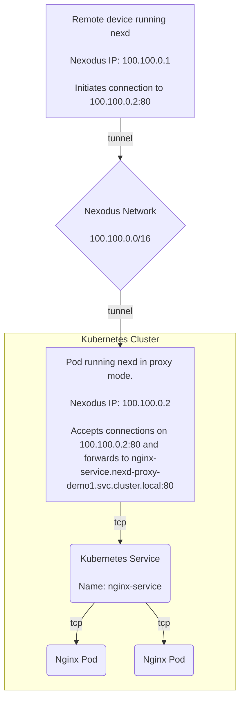
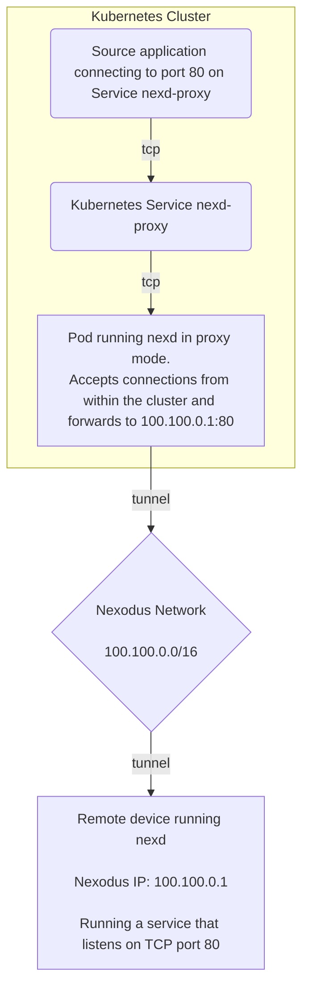
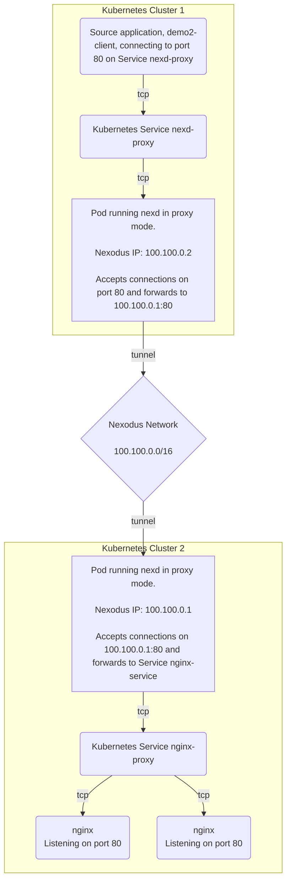

# Nexd Proxy in Kubernetes

The default mode of running `nexd` requires privileges to create a network
device. This prevents using it in a container environment without the ability to
grant those extra privileges. [`nexd proxy`](../../development/design/userspace-mode.md)
addresses this by allowing `nexd` to operate as an L4 proxy. However, the
configuration of the L4 proxy is done in terms of port forwarding rules. For an
application developer using Kubernetes, it is most convenient to define the
desired network connectivity in terms of Kubernetes constructs. This proposal is
to explore some approaches for using Nexodus to achieve connectivity to and from
application resources in Kubernetes.

For now, this document includes scenarios and sample Kubernetes manifests.
Later, we will provide an example of an application that automates these
scenarios. For a more complete discussion of these plans, see the [nexlink
design document](../../development/design/nexlink.md).

## Demo 1 - Exposing a Kubernetes Service to a Nexodus VPC

In this demo, we will run `nexd proxy` in a Pod that will forward
connections to a Service inside of a cluster. This will allow any device within
a Nexodus VPC to reach this service, no matter where they are.

The Pod running `nexd proxy` is using a single ingress proxy rule:

```sh
nexd --service-url https://try.nexodus.io proxy --ingress tcp:80:nginx-service.nexd-proxy-demo1.svc.cluster.local:80 
```



To implement this scenario you will need a Kubernetes cluster and a Nexodus
Service that allows user/password authentication.

First, set a few variables that we will use for this demo. The username and
password will be used by `nexd proxy` to authenticate with the Nexodus Service.

```console
NAMESPACE=nexd-proxy-demo1
USERNAME=username
PASSWORD=password
```

Start by creating a namespace for the demo:

```console
kubectl create namespace "${NAMESPACE}"
```

Next, create a Secret that contains the username and password that `nexd proxy`
will use to authenticate with the Nexodus Service.

```console
kubectl create secret generic nexodus-credentials \
    --from-literal=username="${USERNAME}" \
    --from-literal=password="${PASSWORD}" -n "${NAMESPACE}"
```

We also need a Secret to hold the wireguard keys used by `nexd`. If you need to
create the keys, you can use these commands:

```console
wg genkey | tee private.key | wg pubkey > public.key
```

Once you have the `private.key` and `public.key` files, you can create a Secret
for them.

```console
kubectl create secret generic wireguard-keys \
    --from-literal=private.key="$(cat private.key)" \
    --from-literal=public.key="$(cat public.key)" -n "${NAMESPACE}"
```

Next we need to create a target Service that we will be exposing from the
Kubernetes cluster. For this example, we will a Deployment of nginx with two
replicas. Each will serve up a file giving its Pod name.

Save the yaml to a file called `nginx.yaml` and then apply it to your cluster.

```console
kubectl apply -n "${NAMESPACE}" -f nginx.yaml
```

```yaml
kind: Deployment
metadata:
  name: nginx-deployment
spec:
  replicas: 2
  selector:
    matchLabels:
      app: nginx
  template:
    metadata:
      labels:
        app: nginx
    spec:
      volumes:
      - name: shared-data
        emptyDir: {}
      initContainers:
      - name: init-nginx
        image: nginx
        env:
        - name: POD_NAME
          valueFrom:
            fieldRef:
              fieldPath: metadata.name
        command: ["sh", "-c", "echo \"Hello from $POD_NAME\" > /usr/share/nginx/html/index.html"]
        volumeMounts:
        - name: shared-data
          mountPath: /usr/share/nginx/html
      containers:
      - name: nginx
        image: nginx:latest
        ports:
        - containerPort: 80
        volumeMounts:
        - name: shared-data
          mountPath: /usr/share/nginx/html
---
apiVersion: v1
kind: Service
metadata:
  name: nginx-service
spec:
  selector:
    app: nginx
  ports:
  - name: http
    port: 80
    targetPort: 80
  type: ClusterIP
```

The final step is to create the Deployment for `nexd proxy`. Note that if you
changed the Nexodus Service URL or the namespace used for this demo, you will
need to update the arguments given to `nexd` in this Deployment.

Save this yaml to a file called `demo1.yaml` and then apply it to your cluster.

```console
kubectl apply -n "${NAMESPACE}" -f demo1.yaml
```

```yaml
apiVersion: apps/v1
kind: Deployment
metadata:
  name: nexd-proxy
spec:
  replicas: 1
  selector:
    matchLabels:
      app: nexd-proxy
  template:
    metadata:
      labels:
        app: nexd-proxy
    spec:
      containers:
      - name: my-container
        image: quay.io/nexodus/nexd
        command: ["sh"]
        args: ["-c", "ln -s /etc/wireguard/private.key /private.key; ln -s /etc/wireguard/public.key /public.key; nexd proxy --ingress tcp:80:nginx-service.nexd-proxy-demo1.svc.cluster.local:80 https://try.nexodus.io"]
        env:
        - name: NEXD_USERNAME
          valueFrom:
            secretKeyRef:
              name: nexodus-credentials
              key: username
        - name: NEXD_PASSWORD
          valueFrom:
            secretKeyRef:
              name: nexodus-credentials
              key: password
        - name: NAMESPACE
          valueFrom:
            fieldRef:
              fieldPath: metadata.namespace
        volumeMounts:
        - name: wireguard-keys
          mountPath: /etc/wireguard/
      volumes:
      - name: wireguard-keys
        secret:
          secretName: wireguard-keys
```

Finally, you can validate that the Service is reachable from another device connected to the same Nexodus VPC. You will need the Nexodus IP address associated with the proxy. You can get this by either looking in the `nexd proxy` container log or through the Nexodus Service web UI.

If you check the log, here is what you should see:

```text
{"level":"info","ts":1684542592.4024842,"caller":"nexodus/wg_peers.go:182","msg":"New local Wireguard interface addresses assigned IPv4 [ 100.100.0.1 ] IPv6 [ 200::1 ]"}
```

In this case, the Nexodus IP address is `100.100.0.1` or `200::1`.

From another device in the Nexodus VPC, you should now be able to reach the nginx Service using these IP addresses.

```console
## curl http://100.100.0.1
Hello from nginx-deployment-d76648567-8fmtv

# curl http://100.100.0.1
Hello from nginx-deployment-d76648567-6ppjm

# curl http://[200::1]
Hello from nginx-deployment-d76648567-6ppjm

# curl http://[200::1]
Hello from nginx-deployment-d76648567-8fmtv
```

## Demo 2 - Kubernetes Service to Reach a Resource Over Nexodus

This demo is similar to the first but in the reverse direction. It may be
desirable for an application inside Kubernetes to reach a resource that is
accessible within a Nexodus VPC. An example here could be an
application running in a public cloud that needs to reach a database running in
a corporate data center.

In this example, the Pod running `nexd proxy` is using a single egress proxy rule like this:

```console
nexd proxy --egress tcp:80:100.100.0.1:80
```



To implement this scenario you will need a Kubernetes cluster and a Nexodus
Service that allows user/password authentication.

Prior to setting up the Kubernetes portion of this demo, you will need to set up an http server that listens on port 80 within this Nexodus VPC. During development of the demo, I ran `nexd` in a container and then ran these additional commands in that container. Note that the rest of demo2 assumes that this Nexodus device has the Nexodus IP of 100.100.0.1.

```console
echo "Hello from ${HOSTNAME}" > index.html
pythom -m http.server 80
```

Now you can proceed with setting up the Kubernetes side of this demo. First, set
a few variables that we will use for this demo. The username and password will
be used by `nexd proxy` to authenticate with the Nexodus Service.

```console
NAMESPACE=nexd-proxy-demo2
USERNAME=username
PASSWORD=password
```

Start by creating a namespace for the demo:

```console
kubectl create namespace "${NAMESPACE}"
```

Next, create a Secret that contains the username and password that `nexd proxy`
will use to authenticate with the Nexodus Service.

```console
kubectl create secret generic nexodus-credentials \
    --from-literal=username="${USERNAME}" \
    --from-literal=password="${PASSWORD}" -n "${NAMESPACE}"
```

We also need a Secret to hold the wireguard keys used by `nexd`. If you need to
create the keys, you can use these commands:

```console
wg genkey | tee private.key | wg pubkey > public.key
```

Once you have the `private.key` and `public.key` files, you can create a Secret
for them.

```console
kubectl create secret generic wireguard-keys \
    --from-literal=private.key="$(cat private.key)" \
    --from-literal=public.key="$(cat public.key)" -n "${NAMESPACE}"
```

Next, create a Deployment for `nexd proxy`. It will run with a single egress proxy rule. Note that if the device running the http server is not `100.100.0.1`, the egress proxy rule will need to be adjusted.

```yaml
apiVersion: apps/v1
kind: Deployment
metadata:
  name: nexd-proxy
  namespace: nexd-proxy-demo2
spec:
  replicas: 1
  selector:
    matchLabels:
      app: nexd-proxy
  template:
    metadata:
      labels:
        app: nexd-proxy
    spec:
      containers:
      - name: nexd-proxy
        image: quay.io/nexodus/nexd
        command: ["sh"]
        args: ["-c", "ln -s /etc/wireguard/private.key /private.key; ln -s /etc/wireguard/public.key /public.key; nexd --service-url https://try.nexodus.io proxy --egress tcp:80:100.100.0.1:80"]
        env:
        - name: NEXD_USERNAME
          valueFrom:
            secretKeyRef:
              name: nexodus-credentials
              key: username
        - name: NEXD_PASSWORD
          valueFrom:
            secretKeyRef:
              name: nexodus-credentials
              key: password
        - name: NAMESPACE
          valueFrom:
            fieldRef:
              fieldPath: metadata.namespace
        ports:
        - containerPort: 80
        volumeMounts:
        - name: wireguard-keys
          mountPath: /etc/wireguard/
      volumes:
      - name: wireguard-keys
        secret:
          secretName: wireguard-keys
```

Next, we need a Service that will be used by other applications in the cluster
that desire to reach the HTTP server we are exposing from the Nexodus
VPC.

```yaml
apiVersion: v1
kind: Service
metadata:
  name: nexd-proxy
  namespace: nexd-proxy-demo2
spec:
  selector:
    app: nexd-proxy
  ports:
  - name: http
    port: 80
    targetPort: 80
  type: ClusterIP
```

Finally, we need some sort of application that makes a request to this service.
Here's a sample deployment that runs `curl` in a loop every second.

```yaml
apiVersion: apps/v1
kind: Deployment
metadata:
  name: demo2-client
  namespace: nexd-proxy-demo2
spec:
  replicas: 1
  selector:
    matchLabels:
      app: demo2-client
  template:
    metadata:
      labels:
        app: demo2-client
    spec:
      containers:
      - name: client
        image: fedora:latest
        command: ["sh", "-c", "while : ; do curl -s http://nexd-proxy.nexd-proxy-demo2.svc.cluster.local ; sleep 1 ; done"]
```

Once everything is up and running, the log for the `demo2-client` pod should look something like this, showing whatever data you set up for the http server to return.

```text
Hello from f88da76f423d
Hello from f88da76f423d
Hello from f88da76f423d
Hello from f88da76f423d
Hello from f88da76f423d
...
```

## Demo 3 - Linking Kubernetes Services Across Clusters

This demo shows how to link two Kubernetes clusters together using Nexodus. This will allow an application in one cluster to reach a Service in another cluster. This is the combination of demos 1 and 2. The only change required is to set the IP address in the egress proxy rule from demo 2 to be the IP address associated with `nexd proxy` from demo 1.

The result is that the log from `demo2-client` will now show this message coming from the nginx Pods from demo1.

```text
Hello from nginx-deployment-d76648567-6ppjm
Hello from nginx-deployment-d76648567-6ppjm
Hello from nginx-deployment-d76648567-6ppjm
Hello from nginx-deployment-d76648567-8fmtv
Hello from nginx-deployment-d76648567-8fmtv
Hello from nginx-deployment-d76648567-6ppjm
Hello from nginx-deployment-d76648567-8fmtv
Hello from nginx-deployment-d76648567-8fmtv
Hello from nginx-deployment-d76648567-8fmtv
Hello from nginx-deployment-d76648567-6ppjm
Hello from nginx-deployment-d76648567-8fmtv
Hello from nginx-deployment-d76648567-6ppjm
...
```

