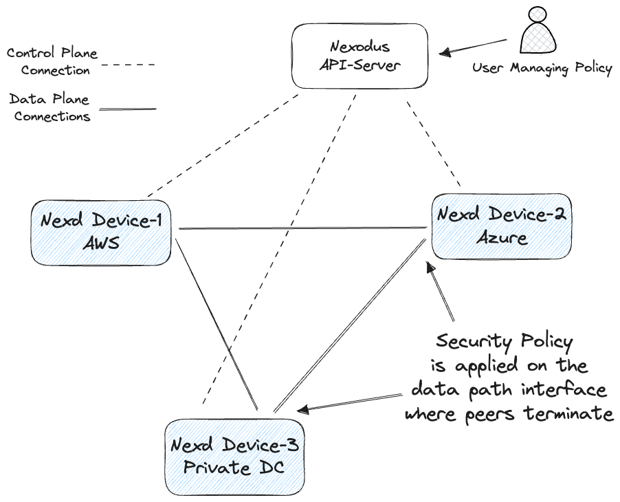

# Security Groups

## Overview

Nexodus Security Groups are virtual firewalls for your Nexodus instances to control inbound and outbound traffic. They act as a white list, only allowing through the traffic that you specify is allowed. Each security group includes a set of rules that filter traffic coming into and out of the instance.



The following provides details for interacting with security groups using the command-line interface in the Nexodus project. It includes CLI examples and detailed information on the required fields. Support for adding groups and rules via the Nexodus UI is pending.

> **Note:**
> The default security group will permit all inbound and outbound traffic. Once you add a permit rule, no traffic other than that explicit permit will be allowed. There are no deny statements. This is a similar policy model that you may be used to when using security groups in AWS.
> The security rules are only applied to the nexodus interface, this will not affect the other interfaces on your device.
> The security group feature will not be supported for organizations created in beta, prior to Jun 7, 2023.

Currently, only one security group per organization is supported. Support for multiple security groups per organization, which enables per-device policies, will be available soon.

The default security group rules are empty, as can be seen in the default security group listing of an organization.

```shell
nexctl --service-url https://try.nexodus.127.0.0.1.nip.io --username admin --password floofykittens security-group list --organization-id="${ORGANIZATION_ID}"
SECURITY GROUP ID                        SECURITY GROUP NAME     SECURITY GROUP DESCRIPTION              ORGANIZATION ID                          SECURITY GROUP RULES INBOUND     SECURITY GROUP RULES INBOUND
cb2e0192-5eb9-41ee-a732-7484602ac883     default                 default organization security group     7e552731-2f5f-421d-9266-10fa46dfe3ee     []                               []
```

Security Groups can be completely disabled on a per-agent basis at runtiime by simply passing the flag `nexd --disable-security-groups`.

## Prerequisites

Ensure that the `nexctl` CLI is installed on your machine and that you also have the `nftables` package, which provides the `nft` command.

## Organization and Security Group Identification

In the provided commands, you'll notice variables `ORGANIZATION_ID` and `SECURITY_GROUP_ID` being used. These are identifiers for the organization and the security group respectively.

You can obtain the IDs from the output of listing organizations.

```shell
nexctl --service-url https://try.nexodus.127.0.0.1.nip.io --username admin --password floofykittens organization list
Organization ID                          NAME      IPV4 CIDR          IPV6 CIDR     DESCRIPTION              SECURITY GROUP ID
cd0fa8be-1c6a-4319-884a-e0377d915774     admin     100.100.0.0/16     200::/64      admin's organization     151acab0-6dde-4870-bacf-2f7134dc5085
```

## Security Group Operations

Here are some examples of operations you can perform with security groups.

### List Security Groups

This command will list all security groups for the specified organization.

```shell
nexctl --service-url https://try.nexodus.127.0.0.1.nip.io \
    --username admin \
    --password floofykittens \
    security-group list --organization-id=${ORGANIZATION_ID}
```

In the following examples, replace `ORGANIZATION_ID` and `SECURITY_GROUP_ID` with your actual organization and security group IDs.

```bash
ORGANIZATION_ID="<UUID_GOES_HERE>"
SECURITY_GROUP_ID="<UUID_GOES_HERE>"
```

Now you can list the security groups for an organization.

```bash
nexctl --service-url https://try.nexodus.127.0.0.1.nip.io --username admin --password floofykittens security-group list --organization-id=${ORGANIZATION_ID} 
```

### Creating a Security Group

```shell
nexctl --service-url https://try.nexodus.127.0.0.1.nip.io --username admin --password floofykittens security-group create \
    --name test-group --description "test group example" \
    --inbound-rules='[{"ip_protocol": "icmp"}]' \
    --outbound-rules='' \
    --organization-id=${ORGANIZATION_ID}
```

### Updating a Security Group

```bash
nexctl \
    --service-url https://try.nexodus.127.0.0.1.nip.io --username admin --password floofykittens security-group update \
    --name="default" --description="security group testing" \
    --inbound-rules='[{"ip_protocol": "icmp"}, {"ip_protocol": "icmpv6"}, {"ip_protocol": "tcp"},{"ip_protocol": "udp"}]' \
    --outbound-rules='[{"ip_protocol": "icmp"}, {"ip_protocol": "icmpv6"}, {"ip_protocol": "tcp"},{"ip_protocol": "udp"}]' \
   --security-group-id="${SECURITY_GROUP_ID}" \
   --organization-id="${ORGANIZATION_ID}"
```

- Permitting TCP to port 22 only

Note: if you do not specify an L3 IP destination prefix, both IPv4 and IPv6 will be permitted.

```bash
nexctl \
    --service-url https://try.nexodus.127.0.0.1.nip.io --username admin --password floofykittens security-group update \
    --name="default" --description="security group testing" \
    --inbound-rules='[{"ip_protocol": "tcp", "from_port": 22, "to_port": 22}]' \
    --outbound-rules='[{"ip_protocol": "tcp"}]' \
   --security-group-id="${SECURITY_GROUP_ID}" \
   --organization-id="${ORGANIZATION_ID}"
```

If you specify an address family specific destination IP prefix, the rule will only be applied to that address family. The following will only allow SSH to the IPv6 prefix of `200::/64`.

```bash
nexctl \
    --service-url https://try.nexodus.127.0.0.1.nip.io --username admin --password floofykittens security-group update \
    --name="default" --description="security group testing" \
    --inbound-rules='[{"ip_protocol": "tcp", "from_port": 22, "to_port": 22, "ip_ranges": ["200::/64"]}]' \
    --outbound-rules='[{"ip_protocol": "tcp"}]' \
   --security-group-id="${SECURITY_GROUP_ID}" \
   --organization-id="${ORGANIZATION_ID}"
```

You can also specify a range of address seperated by a `-` instead of a cidr prefix. In the following, all IPv4 traffic is allowed to ssh to the nexodus address from the address range of `100.100.0.1-100.100.0.50`.

```bash
nexctl \
    --service-url https://try.nexodus.127.0.0.1.nip.io --username admin --password floofykittens security-group update \
    --name="default" --description="security group testing" \
    --inbound-rules='[{"ip_protocol": "tcp", "from_port": 22, "to_port": 22, "ip_ranges": ["100.100.0.1-100.100.0.50"]}]' \
    --outbound-rules='[{"ip_protocol": "tcp"}]' \
   --security-group-id="${SECURITY_GROUP_ID}" \
   --organization-id="${ORGANIZATION_ID}"
```

- Close inbound traffic except for icmp.

```bash
nexctl \
    --service-url https://try.nexodus.127.0.0.1.nip.io --username admin --password floofykittens security-group update \
    --name="default" --description="security group testing" \
    --inbound-rules='[{"ip_protocol": "icmp"}]' \
    --outbound-rules='' \
   --security-group-id="${SECURITY_GROUP_ID}" \
   --organization-id="${ORGANIZATION_ID}"
```

You can add inbound and outbound rules to the security group with the `security-group update` command. The rules are defined in a JSON format.

Here are a few examples:

- This next command will permit any inbound and outbound ICMP, ICMPv6, TCP, and UDP traffic.

```shell
nexctl \
    --service-url https://try.nexodus.127.0.0.1.nip.io --username admin --password floofykittens security-group update \
    --name="default" --description="security group testing" \
    --inbound-rules='[{"ip_protocol": "icmp"}, {"ip_protocol": "icmpv6"}, {"ip_protocol": "tcp"},{"ip_protocol": "udp"}]' \
    --outbound-rules='[{"ip_protocol": "icmp"}, {"ip_protocol": "icmpv6"}, {"ip_protocol": "tcp"},{"ip_protocol": "udp"}]' \
   --security-group-id="${SECURITY_GROUP_ID}" \
   --organization-id="${ORGANIZATION_ID}"
```

- You can also pass an empty rule that will allow all traffic.

```shell
nexctl \
    --service-url https://try.nexodus.127.0.0.1.nip.io --username admin --password floofykittens security-group update \
    --name="default" --description="security group testing" \
    --inbound-rules='' \
    --outbound-rules='' \
   --security-group-id="${SECURITY_GROUP_ID}" \
   --organization-id="${ORGANIZATION_ID}"
```

- Or just specifying the fields you want to update and leaving the rest out will achieve the same effect of opening all traffic.

```shell
nexctl \
    --service-url https://try.nexodus.127.0.0.1.nip.io --username admin --password floofykittens security-group update \
    --name="default" --description="security group testing" \
    --security-group-id="${SECURITY_GROUP_ID}" \
   --organization-id="${ORGANIZATION_ID}"
```

- Allow a range of ports for all address families, IPv4 and IPv6 for UDP from port 8080 to port 9000

```bash
nexctl \
    --service-url https://try.nexodus.127.0.0.1.nip.io --username admin --password floofykittens security-group update \
    --name="default" --description="security group testing" \
    --inbound-rules='[{"ip_protocol": "udp", "from_port": 8080, "to_port": 9000}]' \
    --outbound-rules='[{"ip_protocol": "udp"}]' \
   --security-group-id="${SECURITY_GROUP_ID}" \
   --organization-id="${ORGANIZATION_ID}"
```

This is the same rule as above, but only allowing the traffic inbound from the IP address `100.100.0.50`.

```bash
nexctl \
    --service-url https://try.nexodus.127.0.0.1.nip.io --username admin --password floofykittens security-group update \
    --name="default" --description="security group testing" \
    --inbound-rules='[{"ip_protocol": "udp", "from_port": 8080, "to_port": 9000, "ip_ranges": ["100.100.0.50"]}]' \
    --outbound-rules='[{"ip_protocol": "udp"}]' \
   --security-group-id="${SECURITY_GROUP_ID}" \
   --organization-id="${ORGANIZATION_ID}"
```

- Here is an example of a very long inbound and outbound rules just to demonstrate the various combinations of supported rules a user can apply.

```shell
nexctl \
    --service-url https://try.nexodus.127.0.0.1.nip.io --username admin --password floofykittens security-group update \
    --name="default" --description="security group testing" \
    --inbound-rules='[
        {"ip_protocol": "udp","ip_ranges": ["10.130.0.1-10.130.0.5"],"from_port": 80,"to_port": 90}, 
        {"ip_protocol": "tcp", "from_port": 456, "to_port": 789, "ip_ranges": ["192.168.64.1"]}, 
        {"ip_protocol": "udp", "from_port": 123, "to_port": 124, "ip_ranges": ["172.16.5.1/24"]}, 
        {"ip_protocol":"tcp","from_port":11000,"to_port":40000,"ip_ranges":["F100:0db8:0000:0000:0000:0000:0000:0000 - F200:0db8:ffff:ffff:ffff:ffff:ffff:ffff"]}, 
        {"ip_protocol":"tcp","from_port":443,"to_port":443,"ip_ranges":[""]}, 
        {"ip_protocol":"tcp","from_port":650,"to_port":678}, 
        {"ip_protocol":"tcp","from_port":443,"to_port":500}, 
        {"ip_protocol": "icmpv4","ip_ranges": ["100.100.0.0/16"]},
        {"ip_protocol": "icmpv6"},
        {"ip_protocol": "udp","ip_ranges": ["fd00:face:b00c:cafe::/64","200::1-200::5"],"from_port": 80,"to_port": 90}
    ]' \
    --outbound-rules='[
        {"ip_protocol": "udp","ip_ranges": ["10.130.0.1-10.130.0.5"],"from_port": 80,"to_port": 90}, 
        {"ip_protocol": "tcp", "from_port": 20, "to_port": 70, "ip_ranges": ["192.168.64.1","192.168.64.10-192.168.64.50","100.100.0.128/25"]}, 
        {"ip_protocol": "udp", "from_port": 727, "to_port": 767, "ip_ranges": ["192.168.2.1/24"]}, 
        {"ip_protocol":"tcp","from_port":30000,"to_port":31000,"ip_ranges":["2002:0db8::/64"]}, 
        {"ip_protocol": "tcp", "from_port": 80, "to_port": 80, "ip_ranges": ["192.168.1.1/24"]}, 
        {"ip_protocol": "udp", "from_port": 3333, "to_port": 4444, "ip_ranges": ["192.168.2.1/24"]}, 
        {"ip_protocol": "udp", "from_port": 1, "to_port": 59, "ip_ranges": ["192.168.2.1/24"]}, 
        {"ip_protocol":"tcp","from_port":22,"to_port":29,"ip_ranges":["2003:0db8:0000:0000:0000:0000:0000:0000-2003:0db8:ffff:ffff:ffff:ffff:ffff:ffff"]}, 
        {"ip_protocol": "udp","ip_ranges": ["fd00:face:b00c:cafe::1"],"from_port": 80,"to_port": 90}, 
        {"ip_protocol": "tcp","ip_ranges": ["fd00:face:b00c:cafe::4"]}, 
        {"ip_protocol": "icmpv6","ip_ranges": ["2001:0db8:1337:cafe::/64"]}, 
        {"ip_protocol": "udp", "from_port": 777, "to_port": 788}
    ]' \
    --security-group-id="${SECURITY_GROUP_ID}" \
    --organization-id="${ORGANIZATION_ID}"
```

### Deleting a Security Group

```bash
nexctl \
    --service-url https://try.nexodus.127.0.0.1.nip.io --username admin --password floofykittens \
    security-group delete \
    --security-group-id="${SECURITY_GROUP_ID}" \
    --organization-id="${ORGANIZATION_ID}"
```
