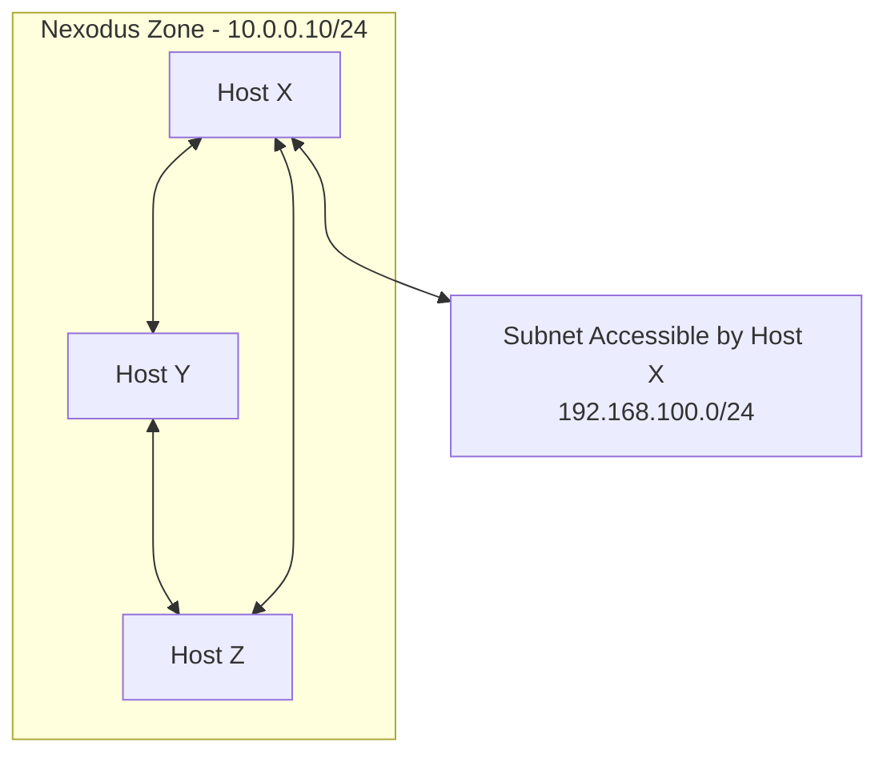

# Subnet Routers

Typically, the Nexodus agent runs on every host that you intend to have connectivity to a Nexodus Organization. However, there may be some cases where you can't do that or don't want to. It is also possible to make a host act as a Subnet Router to provide connectivity between a Nexodus Organization and a host's local Subnet.

In the following diagram, `Host X` acts as a Subnet Router, allowing all hosts within Nexodus Organization A to access `192.168.100.0/24`.

To configure this scenario, the `nexd` agent on `Host X` must be run with the `router --child-prefix` parameter.

```sh
sudo nexd router --child-prefix 192.168.100.0/24 [...]
```

The subnet exposed to the Nexodus Zone may be a physical network the host is connected to, but it can also be a network local to the host. This works well for exposing a local subnet used for containers running on that host. A demo of this use case for containers can be found in [scenarios/containers-on-nodes.md](scenarios/containers-on-nodes.md).

> **Note**
> Subnet Routers do not perform NAT. Routes for hosts in `192.168.100.0/24` to reach Nexodus Zone A via `Host X` must be handled via local configuration that is appropriate for your network.


