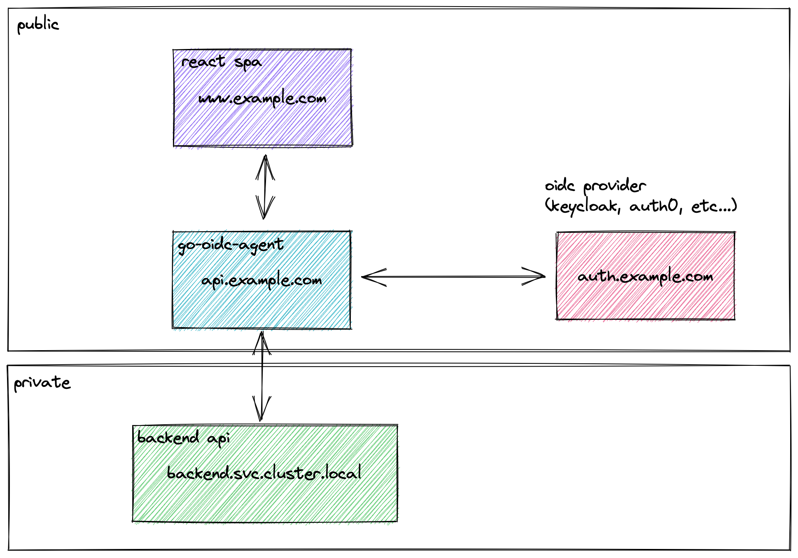

go-oidc-agent
=============

> **Warning**
> This repo is no longer maintained. It's now a package within [Nexodus](https://github.com/nexodus-io/nexodus/)

![Release][badge1] ![License][badge2] ![Build][badge3] ![Coverage][badge4] ![Go Report Card][badge5]

`go-oidc-agent` is a small binary designed to act as a Backend-For-Frontend, handling the OIDC authentication on behalf of the frontend app.

It is heavily influenced by [oauth-agent-node-express](https://github.com/curityio/oauth-agent-node-express) with the following notable differences:

1. It's written in Go
1. The session storage (used for tokens) is swappable so it can use encrypted cookies, memcached etc...
1. It acts as a proxy for request from the frontend the configured backend API, adding the necessary authentication credentials.

There are also some omissions, which will need addressing before this can be used in production.

1. CSRF Token Support

# Design



# Example

There is a working example in the `examples` directory.
To use this you must first add 3 domains to your `/etc/hosts`.

- `auth.widgetcorp.local` - The Auth Server
- `widgets.local` - Your Frontend
- `api.widgets.local` - Backend For Frontend

To start the example, run `docker compose up -d`.

> **Note** Podman Compatibility
> This will work on podman-compose also, but you will need to.
> - Install the latest [development version](https://github.com/containers/podman-compose#installation)
> - Add the following to your `containers.conf` file
> ```conf
> [containers]
> base_hosts_file="none
> ```

You can then browse to `http://widgets.local:8080`, which will redirect you to the login page.

The login page will call the backend to find the login URL, and then redirect you to `http://auth.widgetcorp.local` where you can login with `admin@widgetcorp.com` and the password `admin`.

On successful login, you're redirected back to the frontend.
The frontend sends the received code to the backend where it's exchanged for a token that can be used to access the API. This token is stored in an encrypted cookie.

Once you're fully authenticated, the frontend may then call the `/api` enpdoint of the backend. This proxies requests to the `apiserver` with the credentials from the securecookie injected.


[badge1]: https://img.shields.io/github/v/release/redhat-et/go-oidc-agent?style=for-the-badge
[badge2]: https://img.shields.io/github/license/redhat-et/go-oidc-agent?style=for-the-badge
[badge3]: https://img.shields.io/github/actions/workflow/status/redhat-et/go-oidc-agent/ci.yml?branch=main&style=for-the-badge
[badge4]: https://img.shields.io/coverallsCoverage/github/redhat-et/go-oidc-agent?branch=main&style=for-the-badge
[badge5]: https://goreportcard.com/badge/github.com/nexodus-io/nexodus/pkg/oidcagent?style=for-the-badge
